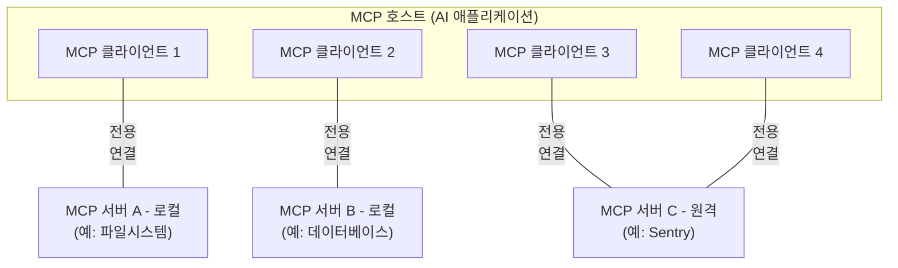
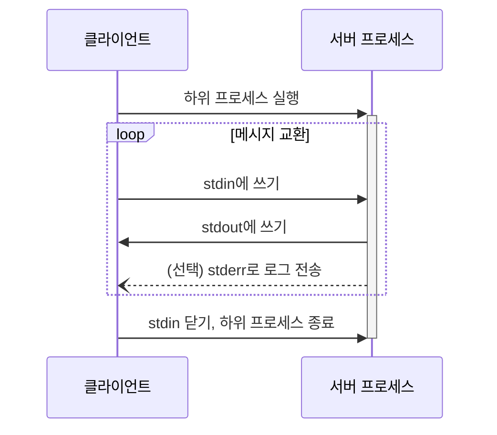
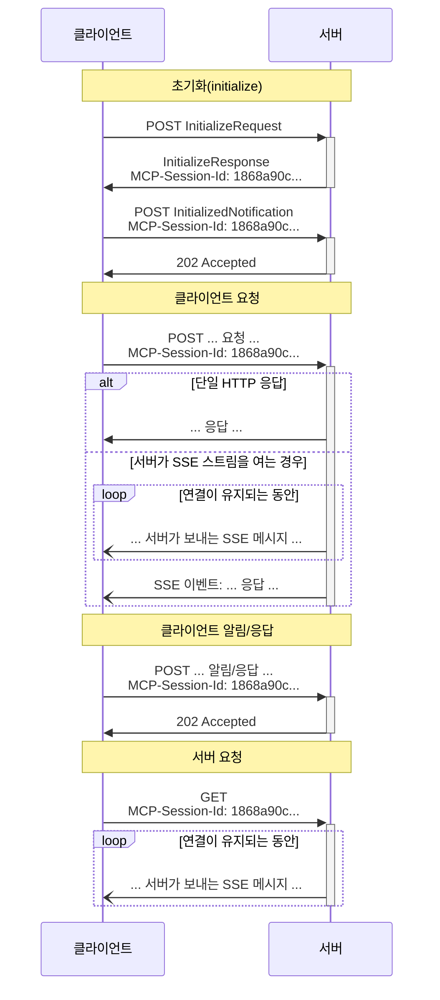
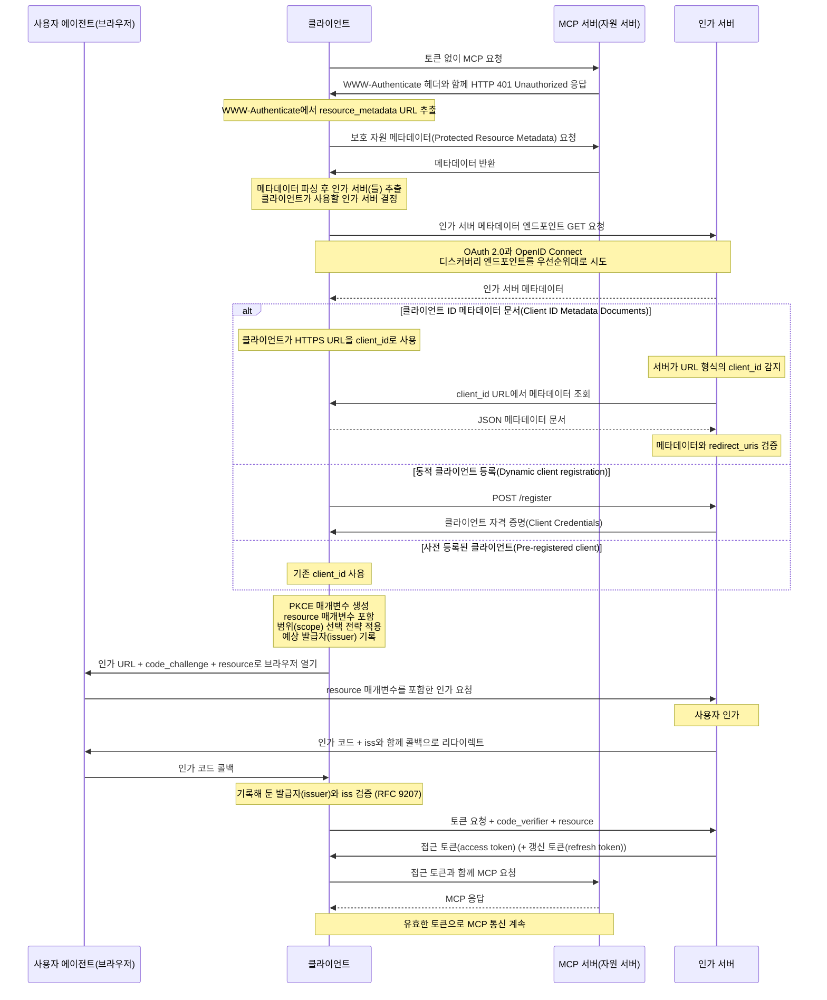
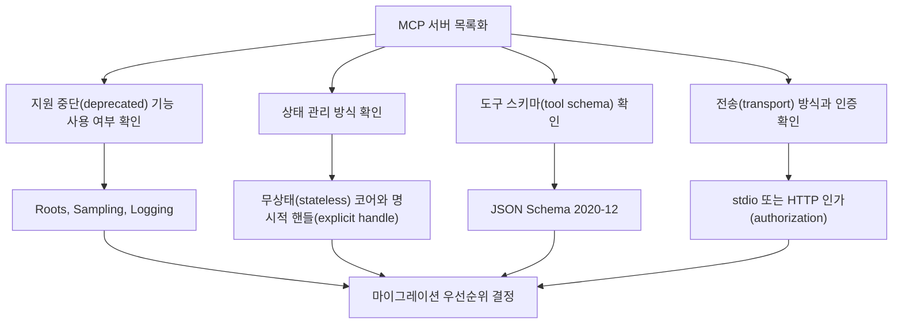

> **일러두기**: 'MCP 7-28'은 2026년 7월 28일 전후로 공개가 예상되는 MCP 스펙 변경을 가리키는 작업명(working name)입니다. 이 블로그 글이 인용하는 SEP(Specification Enhancement Proposal, [SEP-2577](https://github.com/modelcontextprotocol/modelcontextprotocol/blob/main/seps/2577-deprecate-roots-sampling-and-logging.md), [SEP-2575](https://github.com/modelcontextprotocol/modelcontextprotocol/blob/main/seps/2575-stateless-mcp.md), [SEP-2567](https://github.com/modelcontextprotocol/modelcontextprotocol/blob/main/seps/2567-sessionless-mcp.md), [SEP-1613](https://github.com/modelcontextprotocol/modelcontextprotocol/blob/main/seps/1613-establish-json-schema-2020-12-as-default-dialect-f.md), [SEP-2106](https://github.com/modelcontextprotocol/modelcontextprotocol/blob/main/seps/2106-json-schema-2020-12.md) 등)는 이미 완료(Final) 상태이지만, 이를 반영한 정식 스펙 변경(revision)은 이 글을 작성하는 시점 기준으로 아직 정식 공개 전입니다(작성 시점의 최신은 `2025-11-25`). 따라서 이러한 변경의 날짜와 세부 문구, 그리고 '예정/반영/확정' 같은 표현은 정식 릴리즈 시점의 MCP 공식 스펙 / 릴리즈 노트 / SDK 변경 사항을 기준으로 다시 확인하시는 것이 필요합니다.

## 들어가며

[파이토치 한국 사용자 모임(PyTorchKR)](https://pytorch.kr)에서는 PyTorch로 모델을 학습하고 추론하는 이야기뿐 아니라, 그렇게 만들어진 모델을 연구실 밖의 실제 서비스에서 사용하는 것까지 함께 다루고 있습니다. [PyTorchKR 커뮤니티](https://discuss.pytorch.kr)에서 최신 소식과 오픈소스 프로젝트, 주목할 만한 논문과 연구 동향을 꾸준히 정리해 공유하는 것도 결국 같은 목표에서 출발합니다. 모델을 잘 학습시키는 것과, 그 모델이 실제 제품 안에서 유용하게 동작하게 만드는 것은 이제 떼어놓고 생각하기 어렵기 때문입니다.

최근 모델들은 점점 더 에이전트 및 외부 도구들과 함께 사용되고 있으며, MCP(Model Context Protocol)는 그 연결 계층의 표준화된 접점 중 하나입니다. 대규모 언어 모델(LLM)이 현실 세계에서 쓸모를 가지려면 모델 그 자체만으로는 부족합니다. 파일을 읽고, 데이터베이스를 조회하고, 사용자가 원하는 문서를 검색하고, 외부 API를 호출하는 식으로 모델이 현실 세계와 주고받는 통로가 있어야 합니다. MCP는 바로 그 통로를 표준화한 개방형 프로토콜로, 도구마다 제각각인 연동 방식을 매번 새로 만드는 대신, 모델과 외부 도구 / 데이터 / 실행 환경을 잇는 공통 규격 하나로 연결한다고 보면 됩니다. Claude Desktop, Cursor, VS Code 같은 도구가 같은 MCP 클라이언트 규격을 따르는 것도 이 때문입니다.

### MCP(Model Context Protocol)의 동작 방식



MCP의 동작 방식은 호스트(host), 서버(server), 클라이언트(client)의 3가지 주체로 나눠 보면 이해하기 쉽습니다. 사용자가 직접 사용하는 Claude Desktop이나 Cursor와 같은 LLM 애플리케이션이 호스트이고, 호스트 안에서 서버 하나와 1:1로 연결되는 커넥터가 클라이언트(client), 실제 도구와 데이터를 제공하는 쪽이 서버(server)입니다. 이러한 3가지 주체들은 서로 [JSON-RPC 2.0](https://www.jsonrpc.org/specification) 메시지로 요청과 응답을 주고받습니다. 이 글을 작성하는 현재 MCP의 최신 스펙은 [2025년 11월 25일 버전](https://modelcontextprotocol.io/specification/2025-11-25)입니다.

MCP 서버는 자신이 수행할 수 있는 기능을 클라이언트에 노출합니다. 이를 위해 다음 3가지 구성 요소를 클라이언트에 알려주게 됩니다:

- **도구(Tool)**: 모델이 호출해 실제 동작을 실행하는 함수(예: 검색, 파일 읽기, 외부 API 호출).
- **자원(Resource)**: 모델에 컨텍스트로 제공하는 데이터(예: 파일, 문서, 레코드).
- **프롬프트(Prompt)**: 재사용 가능한 프롬프트 템플릿.

서버와 클라이언트의 연결 방식(transport)은 일반적으로 2가지 방식을 사용합니다: (1) 로컬에서 직접 실행하는 MCP 서버의 경우에는 호스트가 서버를 하위 프로세스(subprocess)로 실행한 뒤, 표준입력과 출력(`stdin`/`stdout`)으로 메시지를 주고받는 방식(`stdio`)을 사용합니다.



(2) 원격에서 실행되는 MCP 서버의 경우에는 HTTP 기반의 [Streamable HTTP](https://modelcontextprotocol.io/specification/2025-11-25/basic/transports#streamable-http) 방식을 사용하여 메시지를 주고받습니다. [현재 공개된 스펙(`2025-11-25`)](https://modelcontextprotocol.io/specification/2025-11-25)에 따르면, 클라이언트와 서버는 연결 초기에 초기화(`initialize`) 단계를 통해 서로의 버전과 처리 능력(capability)을 교환한 다음, 맺어둔 연결(session) 위에서 이후 요청과 응답을 이어갑니다.



이번 글에서 살펴볼 'MCP 7-28'에서 이뤄지는 변화의 상당수가 바로 이러한 연결을 맺고(handshake), 유지하는(session) 과정과 관련한 가정들을 정리하는 것과 맞닿아 있습니다. MCP의 개념과 구조를 더 살펴보고 싶다면 PyTorchKR 커뮤니티의 [Deep Research: Model Context Protocol(MCP) 학습 자료](https://discuss.pytorch.kr/t/deep-research-model-context-protocol-mcp/6594)를 먼저 참고하면 좋습니다.

### 새로운 MCP 표준 소개: MCP 7-28

'MCP 7-28'은 2026년 7월 28일 전후로 반영이 예상되는, 다음 버전의 MCP 스펙을 가리키는 작업명(revision)입니다. 이번 변경은 새로운 기능을 추가하기 보다는 마이그레이션 중심 릴리즈에 가깝습니다. MCP의 핵심 프로토콜(Core Protocol)을 더 작고 명확하게 유지하면서 상태 관리, 인증, 스키마, 일부 기존 기능의 생명주기를 정리하는 것이 핵심입니다. 따라서 이번 버전에서 가장 먼저 봐야 할 부분은 '무엇이 사라지고, 무엇이 깨질 수 있는가'입니다.

실제 환경에서 MCP 서버를 개발 및 운영하다 보면 다음과 같은 질문들에 부딪힙니다:
- 모델은 어떤 도구(tool)를 볼 수 있는가?
- 도구 호출 시 인자는 어떤 스키마(schema)로 검증되는가?
- 도구 호출과 호출 사이의 상태는 어디에 저장되는가?
- 파일, 브라우저, 데이터베이스, 문서 검색 같은 외부 자원에 대한 접근 권한은 누가 판단하는가?
- HTTP로 노출된 MCP 서버는 토큰(token), 범위(scope), 대상(audience)을 어떻게 검증하는가?
- 관측성(observability)은 프로토콜 수준의 로깅에 둘 것인가, 애플리케이션 로그 및 추적(trace)에 둘 것인가?

MCP 7-28의 주요한 변화들은 이러한 질문들과 정확히 맞닿아 있으며, 크게 다음 두 축으로 나누어 볼 수 있습니다:

- **사라지는 것(Deprecation)**: `Roots`, `Sampling`, `Logging`이 핵심 프로토콜(core protocol)에서 폐지 예정(deprecated) 대상으로 변경됩니다([SEP-2577](https://github.com/modelcontextprotocol/modelcontextprotocol/blob/main/seps/2577-deprecate-roots-sampling-and-logging.md)). 이러한 기능들이 즉시 사라지는 것은 아니지만, 향후 개발 시에는 더 이상 사용하지 않는 것이 좋습니다.

- **깨질 수 있는 것(Breaking Change)**: 프로토콜을 무상태 우선(stateless-first)으로 옮기고([SEP-2575](https://github.com/modelcontextprotocol/modelcontextprotocol/blob/main/seps/2575-stateless-mcp.md)), 프로토콜 수준 세션(protocol-level session)을 없애 상태를 명시적 핸들(explicit handle)로 드러내며([SEP-2567](https://github.com/modelcontextprotocol/modelcontextprotocol/blob/main/seps/2567-sessionless-mcp.md)), HTTP 전송(transport)의 인가(authorization) 기준을 강화합니다. 여기에 더해, 도구 스키마(tool schema)를 JSON Schema 2020-12 기준으로 정리하면서 도구 계약(tool contract)의 기준을 다시 세웁니다([SEP-1613](https://github.com/modelcontextprotocol/modelcontextprotocol/blob/main/seps/1613-establish-json-schema-2020-12-as-default-dialect-f.md), [SEP-2106](https://github.com/modelcontextprotocol/modelcontextprotocol/blob/main/seps/2106-json-schema-2020-12.md)).

이번 글에서는 특정 SDK의 업그레이드 절차보다, MCP 서버를 **LLM 앱의 도구 인프라(tooling infrastructure)로 운영할 때 무엇을 점검해야 하는지**에 초점을 둡니다. 그래서 이 글의 나머지 부분에서는 이러한 변화들을 항목별로 하나씩, **① 원래 어떤 기능이었는지 → ② 무엇이 어떻게 바뀌는지 → ③ 코드나 설정에는 어떻게 반영되는지 → ④ 그래서 무엇이 좋아지는지**의 순서로 살펴봅니다. 개념을 먼저 정리한 뒤, 실제 MCP 서버 사례와 마이그레이션 체크리스트로 마무리합니다. 라우팅 헤더(routing header), 목록 캐싱(list caching), 추적 전파(trace propagation), Tasks 확장(Tasks extension) 같은 운영 관점 변화는 이 글에서 다루지 않고 [후속 시리즈](https://discuss.pytorch.kr)에서 별도로 다룰 예정입니다.

**이 글에서 다루는 MCP 7-28 변화 한눈에 보기**

| 점검 항목 | 변화의 방향 | 확인해야 할 질문 |
|---|---|---|
| `Roots` | 지원 중단 대상 | 작업 공간(workspace)/파일시스템(filesystem) 접근 범위를 `roots/list`에 기대고 있는가? |
| `Sampling` | 지원 중단 대상 | MCP 서버(server)가 클라이언트(client)/호스트(host)에 LLM 응답 생성(completion)을 요청하는가? |
| `Logging` | 지원 중단 대상 | 운영 로그와 관측성(observability)을 MCP 프로토콜 로깅(protocol logging)에 맡기고 있는가? |
| 무상태/무세션(stateless/sessionless) | 프로토콜 수준 세션 상태(protocol-level session state) 제거, 상태를 명시적 핸들(explicit handle)로 | 요청 하나가 이전 핸드셰이크(handshake)/세션(session) 없이 이해될 수 있는가? 상태를 명시적 ID로 참조하는가? |
| HTTP 인가(Authorization) | HTTP 전송(transport) 보안 기준 강화 | 베어러 토큰(bearer token), 자원 지시자(resource indicator), 범위(scope), 대상(audience) 검증이 있는가? |
| JSON Schema 2020-12 적용 | 도구 계약(tool contract) 기준 정리 | `inputSchema`, `outputSchema`, `structuredContent`가 새 기준과 맞는가? |

## 사라지는 것(Deprecation): `Roots`, `Sampling`, `Logging`

[SEP-2577](https://github.com/modelcontextprotocol/modelcontextprotocol/blob/main/seps/2577-deprecate-roots-sampling-and-logging.md)은 `Roots`, `Sampling`, `Logging`을 핵심 프로토콜에서 지원 중단(deprecated) 대상으로 지정하였습니다. 물론, 이러한 지원 중단이 해당 기능들의 즉시 삭제를 뜻하지는 않습니다. [SEP-2577](https://github.com/modelcontextprotocol/modelcontextprotocol/blob/main/seps/2577-deprecate-roots-sampling-and-logging.md)에서는 지원 중단으로 취급되는 기간 동안 전송 수준 동작(wire-level behavior)은 바뀌지 않고, 타입(type)이나 처리 능력 협상(capability negotiation)도 제거하지 않는다고 설명합니다. 따라서 이 변화는 '오늘 바로 문제가 생긴다'가 아니라 '새로운 MCP 구현 시에는 더 이상 사용하지 않는 것이 좋다' 정도로 이해하는 편이 정확합니다.

### `Roots`

**원래 어떤 기능이었는지**: `Roots`는 클라이언트가 서버에 접근 가능한 로컬 시스템의 디렉토리(Directory)나 파일 경계(File Boundary)를 알려주는 기능입니다. [`filesystem` MCP 서버](https://github.com/modelcontextprotocol/servers/tree/main/src/filesystem)처럼 로컬 시스템의 파일을 다루는 서버에서는 접근 경계가 중요하고, MCP 서버는 `roots/list`로 클라이언트가 알려준 경계를 물어볼 수 있었습니다.

**무엇이 어떻게 바뀌는지**: [SEP-2577](https://github.com/modelcontextprotocol/modelcontextprotocol/blob/main/seps/2577-deprecate-roots-sampling-and-logging.md)에서는 `Roots`가 실제로 접근을 제어하는 장치가 아니라, 참고용 안내(informational guidance)에 가깝다고 봅니다. 이러한 관점에서는 MCP 프로토콜이 서버를 해당 경로 안에 가둬주지 않으므로, '클라이언트가 보낸 `Roots` 내부이니 안전하다'와 같은 가정을 하게 되면 보안 경계가 흐려질 수 있습니다. 따라서, 이러한 기능들을 향후 도구 매개변수(Tool Parameter)나 자원 URI(Resource URI), 서버 설정(Server Configuration), 환경 변수(Environment Variable) 같은 더 명시적인 방식으로 안내하도록 제안하고 있습니다.

**코드/설정에는 어떻게 반영되는지**: 마이그레이션 관점에서는 다음 질문들을 확인해야 합니다:

- MCP 서버 실행 시, 인자로 접근 허용 경로들을 입력으로 받고 있는가?
- 설정 파일이나 환경 변수로 접근 허용 목록(allowlist)을 설정할 수 있는가?
- 도구 매개변수(tool parameter)나 자원 URI(resource URI)에 접근 범위가 명시되어 있는가?
- 호스트(host), 게이트웨이(gateway), 샌드박스(sandbox) 계층에서 파일시스템 정책(filesystem policy)을 강제하고 있는가?
- `roots/list` 결과가 바뀌어야만 MCP 서버가 올바르게 동작하는가?

**그래서 무엇이 좋아지는지**: '클라이언트가 각 세션 내에서, 서버가 알려준 `Roots`를 믿고 동적으로 동작하는 구조'에서 벗어나게 됩니다. 즉, 요청과 서버 설정만 보고도 접근 정책을 판단할 수 있게 됩니다. 그 결과 보안 경계가 프로토콜 수준의 힌트가 아니라, **MCP 서버가 강제하는 정책으로 명확**해집니다.

### `Sampling`

**원래 어떤 기능이었는지**: `Sampling`은 MCP 서버가 클라이언트나 호스트 쪽으로 LLM 응답 생성(completion)을 요청하는 기능입니다. 이 기능을 사용하여 MCP 서버는 자체적인 LLM 모델 연결이나 LLM API Key가 없더라도 클라이언트와 연계된 모델(LLM)을 사용할 수 있다는 장점이 있었습니다.

**무엇이 어떻게 바뀌는지**: 이러한 `Sampling` 기능 자체는 강력하지만, 책임 경계가 흐려지는 문제가 있습니다. 서버가 단순한 도구 제공자(tool provider)인지, 아니면 모델 호출(model invocation)을 지시하는 오케스트레이터(orchestrator)인지 모호해지기 때문입니다. 이에 따라 호출하는 모델을 선택하고, 사용자 승인 UI를 처리하고, 비용 및 정책을 관리하고, 도구 루프(tool loop) 내부에서의 프롬프트 인젝션을 방어하는 책임이 서버와 클라이언트 사이에서 애매해질 수 있습니다. [SEP-2577](https://github.com/modelcontextprotocol/modelcontextprotocol/blob/main/seps/2577-deprecate-roots-sampling-and-logging.md)은 이러한 이유로 `Sampling`을 지원 중단 대상으로 두고, LLM 응답 생성 기능이 필요한 MCP 서버는 LLM 제공자 API를 직접 호출하는 등의 방식을 대안으로 제시합니다.

**코드/설정에는 어떻게 반영되는지**: MCP 서버가 모델의 의존을 줄이는 방향은 다음과 같습니다:

- MCP 서버는 필요한 문맥(context), 프롬프트 후보, 구조화된 결과를 반환합니다.
- 모델 호출(model invocation)은 MCP 호스트(host)나 에이전트 런타임(agent runtime), 애플리케이션 계층(application layer)에서 수행합니다.
- 장기 워크플로우 오케스트레이션(Workflow Orchestration)은 별도 에이전트 런타임(agent runtime)이나 작업 큐에서 관리합니다.
- 서버가 자체적으로 LLM이 필요하다면 LLM API(Provider API)를 직접 통합하고, 그 사실을 도구 계약(tool contract)과 운영 정책에 노출합니다.

**그래서 무엇이 좋아지는지**: MCP 서버의 기본 역할이 '모델을 호출해라'보다 '모델이 판단할 수 있는 도구와 데이터를 안정적으로 제공한다'에 가까워집니다. 책임 경계가 분명해지고, 프롬프트 인젝션이나 데이터 유출 같은 위험 표면도 관리하기 쉬워집니다.

### `Logging`

**원래 어떤 기능이었는지**: `Logging`은 MCP 서버가 프로토콜 메시지(`notifications/message`)로 구조화된 로그를 MCP 클라이언트에 전달하고, 클라이언트가 로그 수준(Logging Verbosity)을 조절할 수 있도록 하는 기능입니다.

**무엇이 어떻게 바뀌는지**: `Logging` 기능의 지원 중단 결정은 로그를 남기지 말라는 뜻이 아닙니다. MCP 프로토콜 기능(Protocol Feature) 중 하나인 `Logging`에 운영 관측성(Observability)을 맡기거나 의존하지 말라는 뜻에 가깝습니다. [SEP-2577](https://github.com/modelcontextprotocol/modelcontextprotocol/blob/main/seps/2577-deprecate-roots-sampling-and-logging.md)에서도 표준에러(`stderr`)나 [OpenTelemetry](https://github.com/open-telemetry) 같은 이미 성숙한 기존의 로깅/관측성(logging/observability) 인프라를 활용하는 것이 [더 적절하다고 안내](https://github.com/modelcontextprotocol/modelcontextprotocol/blob/main/seps/2577-deprecate-roots-sampling-and-logging.md#logging)하고 있습니다.

**코드/설정에는 어떻게 반영되는지**: 운영 환경에서는 다음과 같은 구성들을 적용합니다:

- 로컬에서 실행되는 MCP 서버는 표준 로거(Logger)와 표준에러(`stderr`)를 사용합니다.
- 원격으로 연결되는 HTTP 기반의 MCP 서버는 요청 로그(request log), 감사 로그(audit log), 추적 ID(trace id)를 갖습니다.
- 도구 호출이나 검색(retrieval), 외부 API 호출, 모델 호출 등은 OpenTelemetry 추적(trace)으로 묶습니다.
- 프로토콜 메시지(protocol message)와 애플리케이션 로그(application log)의 책임을 분리합니다.

**그래서 무엇이 좋아지는지**: AI 애플리케이션에서는 한 사용자의 요청 내에 검색(retrieval), 도구 호출(tool call), 모델 호출(model call), 외부 API 호출(external API call) 등이 섞입니다. 프로토콜 로깅(protocol logging) 하나보다는 종단 간 추적(end-to-end trace)이 훨씬 유용해집니다.

> [MCP 공식 저장소](https://github.com/modelcontextprotocol/servers)에서 제공하는 [`filesystem`](https://github.com/modelcontextprotocol/servers/tree/main/src/filesystem)나 [`memory`](https://github.com/modelcontextprotocol/servers/tree/main/src/memory)와 같은 참조 MCP 서버들이 어떻게 영향을 받는지는 뒤에서 다룰 예정입니다.


## 깨질 수 있는 것(Breaking Change): 무상태/무세션 및 HTTP 인가, JSON Schema 2020-12

### 무상태/무세션(stateless/sessionless)

**원래 어떤 구조였는지**: [현재의 MCP 표준](https://modelcontextprotocol.io/specification/2025-11-25)은 `initialize` 핸드셰이크(handshake)와 연결/세션 상태(connection/session state)에 의존하는 부분이 있었습니다. 클라이언트와 서버가 연결 초기에 버전과 처리 능력을 교환하고, 서버가 세션 ID(`Mcp-Session-Id`)를 발급하면, 이후 요청은 이를 헤더에 포함해야 했습니다. 이렇게 고정된 세션 위에서 상태를 관리하는 방식은 로컬에서 하나의 프로세스로 실행되는 경우에는 적절했지만 대규모 확장 시에는 걸림돌이 되었습니다.

**무엇이 어떻게 바뀌는지**: 먼저 [SEP-2575](https://github.com/modelcontextprotocol/modelcontextprotocol/blob/main/seps/2575-stateless-mcp.md)는 상태를 유지하지 않는 방향(stateless-first)을 제안합니다. 만약 HTTP 기반의 원격 MCP 서버가 로드 밸런서(load balancer) 뒤에 있거나 다중 노드(multi-node) 환경에서 운영하면, 특정 클라이언트 세션은 이전에 연결했던 서버의 메모리 상태에 묶여 스티키 세션(sticky session), 세션 저장소(session store), 재개(resumption), 장애 조치(failover)가 필요해지기 때문입니다. [SEP-2575](https://github.com/modelcontextprotocol/modelcontextprotocol/blob/main/seps/2575-stateless-mcp.md)는 이를 개선하기 위해 다음과 같이 제안하고 있습니다:

- 요청은 가능한 한 자기 완결적(self-contained)이어야 합니다.
- 프로토콜 버전과 클라이언트 처리 능력(capabilities)은 매 요청시마다 메타데이터(per-request metadata)로 전달합니다.
- MCP 서버는 지원 버전(version)과 처리 능력(capabilities)을 `server/discover`로 알릴 수 있습니다.
- MCP 서버는 이전 요청의 상태를 알고 있어야만 현재 요청을 처리할 수 있는 형태의 설계나 구현을 피해야 합니다.

여기에 더해, [SEP-2567](https://github.com/modelcontextprotocol/modelcontextprotocol/blob/main/seps/2567-sessionless-mcp.md)은 세션이 없는 방향(sessionless)으로의 개선을 더 밀어붙입니다. 즉, 프로토콜 수준의 세션(protocol-level session) 개념을 제거하고, 애플리케이션의 상태가 필요하면 명시적인 상태 핸들(explicit state handle)을 도구 결과와 인자로 주고받는 형태의 제안입니다.

**코드/설정에는 어떻게 반영되는지**: 무상태/무세션의 변경 사항을 살펴보기 위해, 검색 결과를 제공하는 MCP 서버를 가정해보겠습니다. 이 때, 검색 세션 같은 상태는 다음과 같이 명시적 핸들로 취급합니다:

```text
# 새로운 검색 요청 생성 후, 해당 검색의 상태 핸들 반환(예. srch_7f3a)
1. create_search(query="MCP Roots deprecation")
   -> { "search_handle": "srch_7f3a" }

# 다음 페이지의 검색 결과 요청 시, 이전 검색의 상태 핸들(srch_7f3a)을 추가하여 요청
2. get_search_page(search_handle="srch_7f3a", page=2)
   -> { "items": [...] }

# 검색 완료 후 이전에 사용한 상태 핸들(srch_7f3a)을 제공하여 닫도록 요청
3. close_search(search_handle="srch_7f3a")
   -> { "closed": true }
```

이렇게 무상태/무세션을 가정하더라도 상태는 여전히 서버에 존재할 수 있습니다. 달라지는 것은 상태가 이전 세션에 묶이지 않고, `search_handle`이라는 명시적인 값으로 표현된다는 점입니다. [SEP-2567](https://github.com/modelcontextprotocol/modelcontextprotocol/blob/main/seps/2567-sessionless-mcp.md)은 이것을 새로운 프로토콜의 기본 요소(primitive)가 아니라, 도구 설계 패턴(tool-design pattern)이라고 설명합니다. 즉, 각 핸들은 도구 호출 결과 내부의 문자열이고, 이후 호출에서 인자로 다시 전달되는 문자열일 뿐입니다. 좋은 핸들 설계를 위해서는 불투명한 값을 쓸 것, 매 호출 시 `(handle, auth_context)`를 검증할 것, 핸들의 만료/정리 정책을 명시할 것과 같은 [원칙들](https://github.com/modelcontextprotocol/modelcontextprotocol/blob/main/seps/2567-sessionless-mcp.md#guidance-for-servers)을 참고할 수 있습니다.

**그래서 무엇이 좋아지는지**: 클라이언트의 요청을 아무 서버 노드로 보낼 수 있게 됩니다. 이를 통해 서버의 수평 확장(scale-out)이 쉬워지고, 이전에 연결했던 서버에 문제가 생기더라도 상태가 함께 사라지지 않으며, `tools/list` 같은 목록 결과의 캐싱 또한 쉬워집니다. 이러한 변화는 이전 요청의 상태를 관리해야 하는 브라우저 자동화 서버나 장바구니, 결제 흐름, 오랫동안 실행되는 작업이나 DB 트랜잭션 등을 다뤄야 하는 MCP 서버에는 큰 영향을 미칩니다. 하지만 클라이언트의 호출마다 검색 조건을 받아 결과를 반환하는 조회 위주의 MCP 서버들은 이러한 변화와 충돌할 가능성이 낮습니다.

> 무상태 코어의 정확한 의미를 비롯하여 검색 세션/장기 작업/브라우저 컨텍스트별 핸들 설계, `tools/list`의 세션 독립성, [SEP-2663](https://github.com/modelcontextprotocol/modelcontextprotocol/blob/main/seps/2663-tasks-extension.md)의 Tasks Extension 등은 후속 글에서 다룰 예정입니다.

### HTTP 인가(authorization)

**원래 어떤 구조였는지**: 로컬 MCP 서버의 경우, Claude Desktop이나 Cursor 등과 같은 MCP 호스트가 MCP 서버를 하위 프로세스로 직접 실행합니다. 이러한 상황에서는 MCP 프로토콜이 누가 MCP 서버를 사용하고, 어디까지 접근할 수 있는지를 정하기 어렵습니다. 이미 신뢰 경계가 'MCP 호스트를 사용하는 사람'으로 정해져 있어, MCP가 별도의 인증(authentication)이나 인가(authorization)를 위한 계층을 가질 필요가 적었습니다. 즉, MCP 서버를 LLM 애플리케이션 내부에서 도구를 연결하는 용도로 사용하는 경우에는 인가를 뒤늦게 붙여도 된다고 생각하기 쉬웠습니다.

**무엇이 어떻게 바뀌는지**: [MCP 인가 초안](https://modelcontextprotocol.io/specification/draft/basic/authorization)에서는 HTTP 기반 전송(transport)의 인가 흐름(authorization flow)을 정의했습니다. 인가는 MCP 구현에서 선택 사항(optional)이지만, HTTP 기반 전송이 인가를 지원한다면 이 명세를 따르는 것을 권장하고 있습니다. 다만, 로컬에서 표준입출력(`stdio`) 전송은 이러한 인가 절차 대신, 환경 변수 등 로컬 자격 증명(credential) 전달 방식을 쓰는 것이 좋다고 설명합니다. 개발자가 로컬 환경의 Claude Desktop이나 Cursor 등에서 `legalize-mcp`를 실행하는 상황과, 인터넷에 HTTP 기반의 원격 MCP 서버를 노출하는 상황은 위협 모델(threat model)이 다르기 때문입니다.



**코드/설정에는 어떻게 반영되는지**: HTTP 기반의 원격 MCP 서버에서는 다음 항목들을 확인해야 합니다:

- 인가를 위한 `Authorization: Bearer <access-token>` 헤더가 모든 HTTP 요청에 포함되는가?
- 접근 토큰(access token)을 쿼리 문자열(query string)에 넣지는 않는가?
- OAuth 2.0의 보호 자원 메타데이터(Protected Resource Metadata)와 인가 서버 디스커버리(Authorization Server Discovery)를 제공하는가?
- `resource` 매개변수가 MCP 서버를 대상 자원(target resource)으로 명시하고 있는가?
- MCP 서버가 토큰 대상(token audience)을 검증하는가?
- 인가 범위가 작업 단위로 나뉘고, 부족한 범위에 대해서는 추가 인가 챌린지(`WWW-Authenticate`)를 반환하는가?
- 클라이언트가 401, 403, 유효하지 않거나 만료된 토큰, 부족한 범위(`insufficient_scope`) 오류 등을 복구할 수 있는 형태인가?

**그래서 무엇이 좋아지는지**: MCP 서버가 외부 HTTP 엔드포인트로 노출되는 순간, 도구 계약(tool contract)과 인증 계약(auth contract)이 함께 설계됩니다. 이를 통해 모델은 원격 MCP 서버에서 어떤 도구를 볼 수 있는지, 사용자가 어떤 범위를 허용했는지, 특정 핸들이나 자원에 접근할 권한이 있는지 등을 동일한 요청 경로에서 판단할 수 있습니다.

> OAuth 2.1, 보호 자원 메타데이터, 토큰 대상(audience) 검증, 범위 챌린지(scope challenge) 등, HTTP 인가(authorization) 흐름 자체는 향후 이어질 글에서 더 상세히 다룹니다.

### 계약을 정의하는 JSON Schema 2020-12

**원래 어떤 구조였는지**: MCP 서버에서 도구는 단순한 함수가 아닙니다. 클라이언트와 LLM 입장에서는 도구 이름과 설명, `inputSchema`, `outputSchema`, `structuredContent`가 하나의 계약(contract)입니다. 하지만 그동안에는 이러한 계약에 쓰이는 JSON 스키마의 방언(dialect)이 무엇인지, 인자가 없는 도구의 스키마를 어떻게 표현하는지에 대한 정의가 다소 느슨했습니다.

**무엇이 어떻게 바뀌는지**: 먼저 [SEP-1613](https://github.com/modelcontextprotocol/modelcontextprotocol/blob/main/seps/1613-establish-json-schema-2020-12-as-default-dialect-f.md)은 MCP 메시지 안에 내장된 JSON 스키마의 기본 방언(dialect)을 [JSON Schema 2020-12](https://json-schema.org/draft/2020-12/json-schema-core)로 정리하는 것을 제안합니다. 즉, 별도의 `$schema`가 없으면 JSON Schema 2020-12를 기본으로 보고, `inputSchema`는 `null`이 아니어야 하며, 매개변수가 없는 도구라도 유효한 스키마를 반드시 가져야 합니다. [SEP-2106](https://github.com/modelcontextprotocol/modelcontextprotocol/blob/main/seps/2106-json-schema-2020-12.md)은 여기에 더해 다음과 같이 제약을 완화합니다:

- `inputSchema`는 도구 인자(tool argument)가 객체(object)이므로 `type: "object"`는 유지하되, `oneOf`, `anyOf`, `allOf`를 비롯하여 `if` / `then` / `else` 및 `$ref`, `$defs` 같은 JSON Schema 2020-12의 키워드들도 허용합니다.
- `outputSchema`는 도구 출력(tool output)이 객체뿐 아니라 배열(array)이나 스칼라(scalar)를 비롯한 어떠한 JSON 값도 될 수 있으므로, JSON Schema 2020-12의 객체(object)를 함께 지원합니다.
- `structuredContent`도 객체에만 묶이지 않고 `outputSchema`에 맞는 어떠한 JSON 값(value)을 지원합니다.

**코드/설정에는 어떻게 반영되는지**: 만약 MCP 서버 구현 시, Python 언어로 FastMCP나 Pydantic, 데이터클래스(dataclass) 기반으로 만들고 있다면 다음을 확인해야 합니다:

- SDK가 생성하는 `inputSchema`가 JSON Schema 2020-12 기준으로 유효한가?
- 인자가 없는 도구의 `inputSchema`가 `null`이 되지는 않는가?
- ID 또는 이름으로 조회하는 도구에 `oneOf` 같은 조합 키워드(composition keyword)를 사용할 수 있는가?
- 목록(list) API의 자연스러운 배열 응답을 억지로 객체로 감싸고 있지(wrapper object)는 않은가?
- `structuredContent`와 `outputSchema`가 실제 반환하는 값과 일치하는가?
- `$schema`를 명시해야 하는 내부 도구가 있다면 그 값들을 통일했는가?

**그래서 무엇이 좋아지는지**: MCP 서버가 노출하는 계약이 명확해지면 모델은 도구를 잘못 호출하는 일이 줄어들고, 클라이언트는 검증(validation) 과정에서 실패하는 일이 줄어들며, 출력을 안전하게 후처리할 수 있습니다. 세션 상태와 무관한 조회형 서버라도 스키마가 클라이언트와 맞지 않으면 모델의 도구 사용성이 떨어지므로, 이 변경 사항에 대해서는 모든 형태의 MCP 서버가 점검을 해야 합니다.

> `tools/list`가 실제 계약인 이유를 비롯하여 `optional`과 `nullable`의 구분, `oneOf` / `anyOf` 사용 기준, `outputSchema`와 `structuredContent` 정렬 등은 향후 이어질 글에서 더 다룹니다.

## 사례로 보는 영향도

지금까지 MCP 7-28 스펙에 포함된 SEP(Specification Enhancement Proposal)를 기반으로 어떠한 변화들이 있는지를 살펴봤습니다. 이제 간단한 2가지의 사례를 통해 MCP 서버가 이러한 변화에 어떻게 반응해야 하는지를 확인해보겠습니다. 여기서 중요한 점은 모든 MCP 서버들이 받는 영향도가 동일하지는 않다는 것입니다. 조회형 도구를 제공하는 MCP 서버는 비교적 영향이 적을 수 있으나, 파일시스템이나 브라우저 자동화, HTTP 기반 원격 MCP 서버는 설계 수준부터 다시 검토해야 할 수 있습니다.

### 사례 1: 조회형 MCP 서버, Legalize-KR

[Legalize-KR](https://github.com/legalize-kr/)는 대한민국의 [법령](https://github.com/legalize-kr/legalize-kr), [판례](https://github.com/legalize-kr/precedent-kr), [자치법규](https://github.com/legalize-kr/ordinance-kr), [행정규칙](https://github.com/legalize-kr/admrule-kr) 데이터 저장소들을 [CLI 도구와 MCP 서버](https://github.com/legalize-kr/cli-tools), 에이전트용 스킬로 사용할 수 있도록 하는 오픈소스 프로젝트입니다. Legalize-KR 사용 문서의 MCP 섹션에는 Claude Desktop, Cursor, VS Code 같은 MCP 클라이언트에서 Legalize-KR 데이터를 도구로 호출하는 방식을 설명합니다. 자연어 질문은 에이전트가 해석하고, 실제 법령이나 판례의 조회는 로컬 표준입출력(`stdio`) MCP 서버가 수행하는 구조입니다. [홈페이지에 공개된 MCP 도구 설명](https://legalize.kr/usage.html#mcp)을 살펴보면, Legalize-KR MCP 서버는 조회형에 가깝습니다:

- 지원하는 도구 목록
   - 법령: `laws_list`, `laws_get`, `laws_article`
   - 판례: `precedents_list`, `precedents_get`
   - 자치법규: `ordinances_list`, `ordinances_get`
   - 행정규칙: `admrules_list`, `admrules_get`
   - 통합 검색: `search`
- 설정 예시
   ```json
   {
      "mcpServers": {
         "legalize-kr": {
            "command": "uvx",
            "args": ["--from", "legalize-cli[mcp]", "legalize-mcp"]
         }
      }
   }
   ```

공개 사용된 문서와 코드를 기준으로 보면 Legalize-KR MCP 서버는 장기적인 프로토콜 세션 상태를 가지지 않고, 단순히 매번 도구가 호출될 때마다 필요한 인자를 받아 법령 또는 판례 데이터를 조회하고 결과를 반환합니다. 이러한 구조를 단순화하면 다음과 같이 표현할 수 있습니다:

```python
# 이 코드는 실제 구현을 그대로 옮긴 것이 아니라, 설명용 축약 예시입니다.
mcp = FastMCP("legalize-kr")

@mcp.tool()
def laws_article(
    law_name: str,
    article_no: str,
    date: str | None = None,
) -> str:
    result = fetch_law_article(
        law_name=law_name,
        article_no=article_no,
        date=date,
    )
    return json.dumps(result, ensure_ascii=False)
```

핵심은 `law_name`, `article_no`, `date` 같은 입력이 도구 호출에 명시적으로 들어오고, MCP 서버는 도구 호출 시 받은 입력들만으로 결과를 만들 수 있다는 점입니다. 이런 조회형 서버는 앞서 본 변화들의 영향을 상대적으로 적게 받을 가능성이 높습니다.

| MCP 7-28의 주요 변화 | Legalize-KR 관점의 예상 영향 |
|---|---|
| `Roots` 지원 중단 | 공개 MCP 사용 문서 기준으로 핵심 의존 기능은 아닌 것으로 보입니다. |
| `Sampling` 지원 중단 | 서버가 클라이언트에 LLM 생성을 요청하는 구조가 아니라면 영향이 낮습니다. |
| `Logging` 지원 중단 | MCP 프로토콜 수준 로깅(protocol-level logging)을 운영 핵심 경로로 쓰지 않는다면 영향이 낮습니다. |
| 무상태/무세션 방향 | 조회형 도구(tool) 호출 구조와 잘 맞습니다. 다만 SDK와 프로토콜 버전(protocol version) 반영은 확인해야 합니다. |
| HTTP 인가(authorization) | 로컬 `stdio` 사용 시에는 영향이 적습니다. 만약 원격 HTTP로 노출한다면 별도 점검이 필요합니다. |
| JSON Schema 2020-12 | SDK가 생성하는 `inputSchema`, `outputSchema`가 새 기준과 맞는지 확인해야 합니다. |

위 표에서 볼 수 있듯이, MCP 7-28로의 마이그레이션은 단순히 '내가 만든 MCP 서버 전체'가 아니라 'MCP의 어떠한 기능을 사용하고 있는지'를 기준으로 살펴봐야 합니다.

### 사례 2: 공식 `modelcontextprotocol/servers`의 참조 구현체들

MCP 서버 예시들을 제공하는 [공식 `modelcontextprotocol/servers` 저장소](https://github.com/modelcontextprotocol/servers)도 주의해서 읽어야 합니다. 이 저장소는 MCP 스티어링 그룹(steering group)이 관리하는 소수의 참조 서버(reference server)들의 코드를 제공합니다. 다만 이 저장소 내의 서버들은 프로덕션에 바로 쓸 수 있는 솔루션이 아니라, **MCP 기능과 SDK 사용법을 보여주는 교육용 참조 구현(reference implementation)** 임을 명확히 인지해야 합니다.

이를 바탕으로 공식 저장소에서 제공하는 참조 MCP 서버들의 기능별 영향도를 정리하면 다음과 같습니다:

| 참조 서버 | 주요 살펴볼 부분 | MCP 7-28 관련 포인트 |
|---|---|---|
| `filesystem` | 파일 접근 경계 사례 | `Roots` 지원 중단 이후 허용 목록(allowlist), 실행 인자, 자원 URI(resource URI) 같은 더 명시적인 경계가 중요해집니다. |
| `everything` | 기능 표면 확인용 테스트 서버 | 프롬프트, 자원, 도구 등 기능 조합을 확인하는 데 유용합니다. |
| `memory` | 영속적인 애플리케이션 상태 사례 | '상태가 있다' vs. '프로토콜 세션에 암묵적으로 묶인다'의 구분이 필요합니다. |
| `sequential-thinking` | 여러 호출에 걸친 컨텍스트 사례 | 호출 간 컨텍스트를 도구 인자와 결과로 어떻게 드러낼지 점검할 수 있습니다. |
| `git` | 저장소 도구 사례 | 로컬 파일과 Git 작업 권한이 어디서 제한되는지 확인해야 합니다. |

위와 같이 정리한 참조 서버 중 `filesystem`과 `memory`를 실제 구현 수준에서 조금 더 들여다보면, 앞서 살펴봤던 조회형 서버 사례와는 다른 결의 고려사항이 드러납니다.

#### `filesystem`: 접근 경계를 `Roots`에 의존하는 서버

[`filesystem` 서버](https://github.com/modelcontextprotocol/servers/tree/main/src/filesystem)는 파일 읽기/쓰기를 포함하여 디렉토리 생성/목록/이동, 검색, 메타데이터 조회 도구들(`read_text_file`, `write_file`, `edit_file`, `list_directory`, `search_files`, `get_file_info`, `list_allowed_directories` 등)을 포괄적으로 제공하는 MCP 서버입니다. 이 때, 모든 파일 작업들은 '허용된 디렉토리(allowed directories)' 내부로 제한되어 있습니다.

앞서 MCP 7-28의 주요한 변화들 중, 이러한 허용 디렉토리를 정하는 방식에서의 변화를 살펴봤습니다. 먼저 [`filesystem` 서버의 README.md 문서](https://github.com/modelcontextprotocol/servers/tree/main/src/filesystem/README.md)에서는 다음과 같은 두 가지 방식으로 허용 디렉토리를 지정할 수 있다고 설명하고 있습니다:

- **명령줄 인자**: 서버 시작 시 허용 경로를 직접 넘기는 방식으로, `mcp-server-filesystem /path/to/allowed/dir1 /path/to/allowed/dir2` 또는 다음과 같이 설정할 수 있습니다:
  ```json
  {
    "mcpServers": {
      "filesystem": {
        "command": "npx",
        "args": ["-y", "@modelcontextprotocol/server-filesystem", "/path/to/allowed/dir1", "/path/to/allowed/dir2"]
      }
    }
  }
  ```

- **MCP `Roots` (권장하는 방식)**: MCP 클라이언트가 `Roots`를 알려주면, MCP 서버에서는 이를 허용 디렉토리로 **완전히 대체**하고, `notifications/roots/list_changed`로 서버 재시작 없이 런타임에서 직접 갱신할 수 있습니다 (단, 명령줄 인자도 없이 시작했고 클라이언트도 `Roots`를 지원하지 않으면 초기화 단계에서 오류가 납니다).

위 2가지 방식 중, 권장하는 방식(`Roots`를 사용하는 방식)이 MCP 7-28의 변경 사항과 정면으로 만납니다. 문서가 **권장하는** 접근 경계 전달 방식이 [SEP-2577](https://github.com/modelcontextprotocol/modelcontextprotocol/blob/main/seps/2577-deprecate-roots-sampling-and-logging.md)에서 지원 중단을 제안한 `Roots`를 사용하고 있기 때문입니다.

다만, 정확히 구분할 점이 있습니다. 실제 접근 *강제*는 `Roots` 기능 자체가 아니라, MCP 서버가 경로 검증을 통해 허용 디렉토리 밖의 접근을 차단합니다. `Roots`는 **허용 디렉토리 목록을 동적으로 전달하고 갱신하는 수단**일 뿐입니다. 따라서 지원 중단으로 흔들리는 것은 파일 접근 통제 자체가 아니라 '`Roots`를 통한 런타임 동적 갱신'이라는 경로일 뿐입니다. 이를 해결하기 위해서는 명령줄 인자 및 설정 파일, 그리고 (앞서 본) 명시적 도구 매개변수나 자원 URI 등으로 접근 범위를 노출하는 것입니다. 지원 중단이 되더라도 당분간은 전송 수준 동작(wire-level behavior)이 유지되므로 당장 이러한 변화가 문제가 되지는 않겠지만, 새로 설계하는 MCP 서버에서는 **'클라이언트가 세션 중에 넘겨준 `Roots`'를 경계의 1차 근거로 삼지 않는 편이 안전**합니다.

#### `memory`: 상태는 있지만 세션에 묶이지 않는 서버

[`memory` 서버](https://github.com/modelcontextprotocol/servers/tree/main/src/memory)는 엔티티(entity)와 관계(relation), 관찰(observation)로 이루어진 지식 그래프(Knowledge Graph)를 로컬 JSONL 파일(`MEMORY_FILE_PATH` 환경 변수, 기본값 `memory.jsonl`)에 지속적으로 저장합니다. 이를 통해 모델이 여러 대화들을 넘나들며 정보를 기억하고 조회할 수 있습니다. `memory` 서버가 제공하는 도구들은 `create_entities`, `create_relations`, `add_observations`, `delete_entities`, `delete_observations`, `delete_relations`, `read_graph`, `search_nodes`, `open_nodes`이고, 그래프 전체를 `memory://knowledge-graph` 자원으로도 노출합니다. 그래프에 저장되는 엔티티 하나는 대략 이러한 형태입니다:

```json
{ "name": "John_Smith", "entityType": "person", "observations": ["Speaks fluent Spanish"] }
```

`memory`는 분명히 **상태를 갖는(stateful)** 서버입니다. 하지만 그 상태는 현재 MCP 세션이 아니라 **파일에 저장된 지식 그래프 자체**에 있습니다. 상태를 가리키는 식별자는 세션 ID가 아니라 `name`이라는 명시적 키이고, 그래프 전체는 자원 URI를 통해 지정할 수 있습니다. 앞서 살펴본 참조 MCP 서버들의 기능별 영향도 표에서 `memory` 서버를 '상태가 있다'와 '프로토콜 세션에 암묵적으로 묶인다'를 구분하는 사례로 둔 것도 이러한 이유에서 입니다. `create_entities`로 이름을 만들고, 그 이름을 다시 인자로 넘겨 `open_nodes`나 `search_nodes`로 조회하는 흐름은 앞서 설명한 **명시적 상태 핸들(explicit handle) 패턴에 가깝습니다** (상태 핸들이 서버가 발급한 불투명한 ID가 아니라, 사용자 또는 모델이 정한다는 차이가 있습니다).

그래서 `memory` 같은 MCP 서버에서는 MCP 7-28을 살펴볼 때 지원 중단 기능보다는 운영 및 확장 쪽을 살펴봐야 합니다:

- **수평 확장**: 기본 저장소가 단일 JSONL 파일, 즉 프로세스 로컬 파일입니다. MCP 7-28이 제안하는 '요청을 아무 인스턴스로나 보낼 수 있다'를 만족하려면 여러 인스턴스가 공유하는 저장소가 필요합니다.
- **격리와 인가**: 현재는 하나의 그래프만 생성되어 다중 사용자 및 테넌트 격리가 제공되지 않습니다. 원격 MCP 서버로 노출하기 위해서는 사용자별 파일이나 네임스페이스 단위로 그래프를 분리하고, 요청 시 핸들 값(`name`)뿐만 아니라 인가 여부도 함께 검증(`(name, auth_context)`)해야 합니다.
- **자원 구독과 캐싱**: 변경 도구들이 `memory://knowledge-graph`에 대해 `notifications/resources/updated` 알림을 발행합니다. 만약 클라이언트가 이러한 알람에 의존한다면, 목록 및 자원 캐싱과 무효화(invalidation) 흐름이 서로 맞는지 확인해야 합니다.

[공식 `modelcontextprotocol/servers` 저장소](https://github.com/modelcontextprotocol/servers)가 제공하는 참조 서버들은 MCP 서버를 만드는 시작점이기도 하지만, 상용화를 위해서는 보안 경계, 인증/인가, 관측성, 배포 구조를 각 서비스의 위협 모델(threat model)에 맞춰서 다시 설계하고 구현해야 합니다.

## 내 MCP 서버는 어디에 속하는가?

앞서 살펴본 사례처럼 MCP 7-28 변경의 마이그레이션 우선순위는 서버 유형에 따라 달라집니다. 아래 흐름으로 내 서버가 어느 쪽에 가까운지 먼저 분류하면 우선순위를 잡기 쉽습니다:




또는, 제공하고 있는 MCP 서버의 기능에 따라 MCP 7-28 변화의 영향도를 가늠해 볼 수 있습니다. 다음은 상대적으로 영향이 적을 것으로 예상하는 MCP 서버 유형입니다:

- 조회 기능 위주의 도구 중심 서버
- 각 도구 호출이 필요한 입력을 모두 매개변수로 받는 서버
- 프로토콜 세션 상태(Protocol Session State)에 의존하지 않는 서버
- `Roots`, `Sampling`, `Logging`을 핵심 기능으로 쓰지 않는 서버
- 로컬 표준입출력(`stdio`) 환경에서만 사용하는 서버
- 인증이 로컬 환경 변수나 클라이언트 설정으로 제한되는 서버


하지만 다음과 같은 유형의 MCP 서버들은 상대적으로 MCP 7-28 변화의 영향도가 클 수 있으므로 세심하게 살펴봐야 합니다:

- 파일시스템 작업 공간을 `Roots` 기능에 의존해 동적으로 바꾸는 서버
- MCP 서버가 클라이언트/호스트의 `sampling/createMessage`를 호출하는 서버
- MCP 프로토콜 수준 로깅(protocol-level logging)을 운영 로그로 쓰는 서버
- 브라우저 컨텍스트, 장바구니, 결제, DB 트랜잭션, 장기 실행 작업 등을 세션에 묶는 서버
- `tools/list`, `resources/list`, `prompts/list` 결과가 세션마다 달라지는 서버
- HTTP 전송으로 외부에 노출되지만 토큰 대상, 범위, 디스커버리가 약한 서버

이러한 범주에 속한다면 MCP 7-28을 단순한 호환성 업데이트가 아니라 설계 점검의 기회로 봐야 합니다.

## 마이그레이션 체크리스트

MCP 7-28의 최종 스펙과 SDK 릴리즈 노트를 다시 확인해야겠지만, 이 글을 작성하는 현재 기준으로는 다음 순서로 점검할 수 있습니다:

1. 서버가 사용하는 MCP 기능을 목록화합니다:
   - `Tools`, `Resources`, `Prompts`, `Roots`, `Sampling`, `Logging`, `Tasks`, `Elicitation` 또는 커스텀 확장(Custom Extension) 사용 여부를 확인합니다.

2. 지원 중단(Deprecated) 기능의 사용 여부 및 의존도를 확인합니다:
   - `Roots`, `Sampling`, `Logging` 기능을 사용하지 않으면 영향이 적을 수 있습니다.
   - 만약 하나 이상의 기능을 사용하거나 의존하고 있다면 대체 설계 또는 제거 일정을 잡습니다.

3. 세션 상태(Session State)를 찾습니다:
   - MCP 서버 메모리에 클라이언트별 상태를 보관 및 사용하고 있는지 확인합니다.
   - 상태 관리가 필요하다면 세션 대신 명시적 핸들로 드러낼 수 있는지 봅니다.

4. 목록 엔드포인트가 세션별로 달라지는지 확인합니다:
   - `tools/list`, `resources/list`, `prompts/list` 결과가 연결이나 세션 상태에 따라 바뀌면 재설계가 필요할 수 있습니다.

5. 상태 핸들 설계를 검토합니다:
   - 불투명한 핸들(opaque handle), 만료(expiry), 정리(cleanup), 권한 검증, 오류 메시지, 복구 도구(tool)를 점검합니다.

6. HTTP 전송 시 인증을 점검합니다:
   - 베어러 토큰(Bearer Token), 자원 지시자(Resource Indicator), 보호 자원 메타데이터(Protected Resource Metadata), 인가 서버 디스커버리(Authorization Server Discovery), 범위 챌린지(Scope Challenge), 대상 검증(Audience Validation) 등을 점검합니다.

7. 도구 스키마(tool schema)를 덤프(dump)해서 검증합니다:
   - [JSON Schema 2020-12](https://json-schema.org/draft/2020-12/json-schema-core)를 기준으로 `inputSchema`, `outputSchema`, `structuredContent`를 확인합니다.

8. 공식 참조 서버를 참고합니다:
   - `filesystem`, `everything`, `memory`, `sequential-thinking`, `git` 같은 참조 서버(reference server)를 기능별 영향도 샘플로 봅니다.

9. 스모크 테스트를 준비합니다:
   - 대표 도구 호출, 스키마 목록화(schema listing), 인증 실패/성공, 핸들 만료, 오류 메시지 등을 최소 테스트로 둡니다.

## 마무리

MCP 7-28 변화를 살펴볼 때 중요한 점은 '어떠한 기능이 새로 생겼는가'라기보다 '내가 만든 MCP 서버가 어떤 기능을 사용하고 있는가'입니다. 예시로 살펴본 Legalize-KR 같은 조회형 도구 서버는 무상태/무세션 방향과 잘 맞을 가능성이 큽니다. 반대로 `Roots`, `Sampling`, `Logging`, 세션 범위의 상태 관리, HTTP 인가에 의존하는 MCP 서버는 설계와 운영 방식을 함께 점검해야 합니다.


## 더 읽어보기

- [Model Context Protocol의 새로운 MCP 7-28 스펙 소개 블로그](https://blog.modelcontextprotocol.io/posts/2026-07-28-release-candidate/)
- [SEP-2577](https://github.com/modelcontextprotocol/modelcontextprotocol/blob/main/seps/2577-deprecate-roots-sampling-and-logging.md): [`Roots`, `Sampling`, `Logging` 지원 중단](https://modelcontextprotocol.io/seps/2577-deprecate-roots-sampling-and-logging)
- [SEP-2575](https://github.com/modelcontextprotocol/modelcontextprotocol/blob/main/seps/2575-stateless-mcp.md): [MCP를 무상태로 전환](https://modelcontextprotocol.io/seps/2575-stateless-mcp)
- [SEP-2567](https://github.com/modelcontextprotocol/modelcontextprotocol/blob/main/seps/2567-sessionless-mcp.md): [명시적 상태 핸들을 통한 무세션 MCP](https://modelcontextprotocol.io/seps/2567-sessionless-mcp)
- [SEP-1613](https://github.com/modelcontextprotocol/modelcontextprotocol/blob/main/seps/1613-establish-json-schema-2020-12-as-default-dialect-f.md): [MCP의 기본 방언으로 JSON Schema 2020-12 확립](https://modelcontextprotocol.io/seps/1613-establish-json-schema-2020-12-as-default-dialect-f)
- [SEP-2106](https://github.com/modelcontextprotocol/modelcontextprotocol/blob/main/seps/2106-json-schema-2020-12.md): [도구 `inputSchema` 및 `outputSchema`의 JSON Schema 2020-12 준수](https://modelcontextprotocol.io/seps/2106-json-schema-2020-12)
- [Legalize-KR MCP 사용법](https://legalize.kr/usage.html#mcp)
- [공식 MCP 참조 서버 저장소](https://github.com/modelcontextprotocol/servers)
