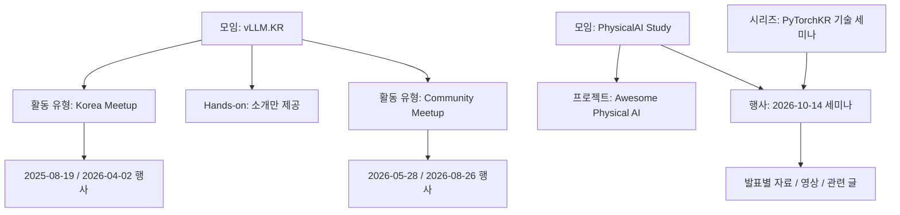

# PyTorchKR 홈페이지 개편 계획과 콘텐츠 초안

검토 기준일: 2026년 10월 2일, 한국 시간. 조사·설계안과 구현 결과를 함께 보관합니다. 아래 현황 설명은 개편 전 조사 시점 기준입니다.

**구현 상태:** `feat/community-homepage` 브랜치에 프로젝트 5개·모임 5개·행사 13건을 구현했습니다. 운영 절차는 [작성 가이드](content-guide.md), 추가된 과거 행사 근거는 [복원 기록](archive-restoration-2026-10-02.md), 실행 검증은 [검증 보고서](verification-2026-10-02.md)를 참고하세요. 자료 저장소 생성·외부 업로드는 수행하지 않았습니다.

**기존 Jekyll·Bootstrap·SCSS 구성을 유지하면서 `프로젝트`와 `모임·행사`를 추가하는 방안을 권장합니다.** 프로젝트는 공개 산출물을, 모임은 지속적인 활동 주체를, 행사는 날짜가 있는 개별 회차를 소개합니다. 행사 하나를 Markdown 파일 하나로 등록하면 홈페이지, 모임 페이지, 프로젝트 페이지, 행사 목록에 함께 반영되도록 구성합니다.

대용량 발표자료는 홈페이지의 Git 이력과 빌드에서 분리합니다. 초기에는 별도 자료 저장소의 GitHub Releases가 간단하며, PDF를 자체 도메인에서 안정적으로 열람시키는 요구가 커지면 R2 같은 객체 저장소를 선택할 수 있습니다. 영상은 YouTube에 두고 발표 단위로 자료와 연결합니다.

유지보수의 기본은 공통 템플릿·작성 가이드·자동 검증입니다. AI Agent는 같은 규칙으로 콘텐츠를 작성하는 선택 가능한 도구로 둡니다. 사람이 직접 수정할 수 있는 경로를 함께 유지해야 특정 도구나 구독의 변화에도 운영을 이어갈 수 있습니다.

## 1. 확인한 현황과 개편 방향

### 현재 사이트

현재 상단 메뉴는 `배우기 / 블로그 / 문서 / 커뮤니티`입니다. 홈페이지는 영문 PyTorch 소개 문구, 최신 블로그, 커뮤니티 최신 글, 기능 소개, 설치 도구, 클라우드 안내, 생태계 소개 순으로 구성됩니다. 국내 활동의 규모와 종류가 늘어난 현재에는 프로젝트 참여와 행사 탐색을 위한 안내가 부족합니다. [현재 홈페이지](https://pytorch.kr/)

| 위치 | 확인한 내용 | 개편 방향 | 구현 시 확인할 사항 |
|---|---|---|---|
| 상단 메뉴 | 프로젝트·모임으로 가는 독립 진입점이 없음 | 기존 4개 메뉴에 2개 메뉴 추가 | 데스크톱·모바일 메뉴와 현재 위치 표시 |
| 첫 화면 | 남산 야경과 큰 영문 프레임워크 소개가 중심 | 사진·로고를 유지하고 한국 커뮤니티의 활동과 참여 경로 소개 | 긴 한국어 제목, 사진 위 대비, 작은 화면의 줄바꿈 |
| 최신 콘텐츠 | 번역 블로그와 커뮤니티 최신 글에 활동 공지가 섞임 | 다가오는 행사와 최근 활동 기록을 별도 배치 | 모집 종료·취소·자료 비공개 상태 |
| 프로젝트 영역 | 글로벌 생태계 소개와 국내 프로젝트의 구분이 약함 | `PyTorchKR 프로젝트`와 `PyTorch 공식 생태계` 명칭 구분 | OSS Landscape와 공식 Landscape 링크 혼동 방지 |
| 행사 기록 | 블로그·이벤터스·외부 블로그 등에 분산 | 공식 원문을 연결하는 고정 행사 페이지 제공 | 외부 행사도 포함하고 원문 URL 유지 |

저장소에서는 다음 재사용 지점을 확인했습니다.

- `_data/navigation.yml`: 데스크톱·모바일 메뉴의 공통 데이터입니다.
- `_includes/main_menu.html`, `_includes/mobile_menu.html`: 기존 메뉴를 확장할 수 있습니다.
- `_config.yml`: `events` 컬렉션이 이미 선언되어 있으나 현재 체크아웃에 `_events` 콘텐츠 디렉토리는 없습니다.
- `_layouts/general.html`: 신규 상세 페이지의 공통 외곽 레이아웃으로 사용할 수 있습니다.
- `_sass/_variables.scss`, `_sass/homepage.scss`: 기존 색상·간격·홈페이지 스타일을 재사용합니다.
- `.gitmodules`: `_hub`, `_coc` 서브모듈이 있습니다. `_hub`는 사이트를 구성하는 문서 소스입니다.
- `.github/workflows/deploy-www.yml`: master push와 매일 정기 빌드가 있으며, 현재 배포는 Pages artifact 방식입니다. README의 gh-pages 브랜치 설명과 차이가 있으므로 유지보수 가이드에는 실제 워크플로를 기준으로 적습니다.
- `.github/workflows/preview-pr.yml`: PR 미리보기 구성이 있습니다. 외부 fork PR은 현재 Surge 배포 조건에서 제외됩니다.

### 올해 계획과 공개 정보의 대조

사용자가 지정한 지원사업 디렉토리에서 지원신청서, 7월 25일 활동계획 발표자료, 9월 국내행사 신청서, 9월 개발환경 결과보고 검토본의 활동 내용을 확인했습니다. 제출 문서는 방향과 계획을 파악하는 근거이며, 현재 모집 일정과 공개 상태는 최신 행사 페이지·저장소를 우선합니다.

| 항목 | 확인 내용 | 홈페이지 반영 |
|---|---|---|
| PyTorch Day Korea | 초기 지원 문서는 10월 31일 계획, 현재 공개 공지는 11월 21일 | 2026-11-21 사용. 초기 계획을 현재 일정으로 복사하지 않음 |
| Physical AI | 초기 문서는 스터디와 후속 세미나 계획, 현재 10월 14일 세미나 공개 | 스터디·결과물·세미나를 서로 연결 |
| Awesome Physical AI | 사용자가 PhysicalAI Study의 결과물 중 하나라고 확인 | 프로젝트에도 등록하고 모임의 결과물로 연결 |
| vLLM.KR | Korea Meetup, Hands-on, Community Meetup의 3가지 활동. Hands-on에는 PyTorchKR이 관여하지 않으며 회차 정보를 관리하지 않음 | 3가지 활동을 소개하되 Korea Meetup·Community Meetup만 상세 기록 |
| terms-kr | 현재 README는 PoC이며 AI 초안의 커뮤니티 검토를 명시 | 완성된 표준 용어집이라고 표현하지 않음 |
| Papers | 9월 검토본에 개발 활동이 있으며 공개 서비스도 확인 | 추가 프로젝트 후보. 공개 GitHub 주소가 확인되기 전 GitHub 버튼 생략 |
| KODFC·KoASR | 지원 문서에는 개발 계획이 있으나 이번 조사에서 공개 결과물은 확인하지 못함 | 공개 프로젝트 목록의 필수 초기 항목에서 제외하고 추후 확인 |
| 정량 목표 | 프로젝트 수·번역 커버리지·참여자 수 등의 목표 존재 | 달성 여부를 검증하기 전 홈페이지 성과 숫자로 사용하지 않음 |

[PyTorch Day Korea 공지](https://discuss.pytorch.kr/t/11390), [Physical AI 세미나](https://event-us.kr/pytorchkr/event/135213), [terms-kr](https://github.com/PyTorchKR/terms-kr), [Papers 서비스](https://papers.pytorch.kr/)

## 2. 메뉴 구성

상단 메뉴는 **`배우기 / 프로젝트 / 모임·행사 / 블로그 / 문서 / 커뮤니티`**의 6개를 권장합니다. 사용자가 제안한 `(소)모임`의 의미를 포함하면서 컨퍼런스와 기술 세미나도 자연스럽게 찾을 수 있도록 `모임·행사`로 표기합니다.

| 메뉴 | 하위 내용 | 역할 |
|---|---|---|
| 배우기 | PyTorch 시작하기, 기본 익히기, 한국어 튜토리얼, 한국어 모델 허브 | 학습 콘텐츠 이용 |
| 프로젝트 | 전체 프로젝트, tutorials-kr, hub-kr, OSS Landscape, AI/ML 용어집, Awesome Physical AI | 산출물 소개와 기여 경로 |
| 모임·행사 | 모임 소개, 다가오는 행사, 지난 행사와 발표자료 | 참여와 활동 기록 탐색 |
| 블로그 | 기존 전체 글, 활동 후기·기술 글·번역 구분 | 읽을거리와 상세 회고 |
| 문서 | PyTorch API, Domain API 소개, 공식 튜토리얼 | 공식 기술 참조 |
| 커뮤니티 | 한국어 커뮤니티, PyTorchKR 소개, 기여 안내, 행동 강령 | 질문·토론·운영 정보 |

초기에는 프로젝트·모임 메뉴를 각 목록 페이지로 바로 연결해도 충분합니다. 개별 항목이 늘어날 때마다 상단 메뉴를 수정하지 않도록 전체 목록을 중심으로 구성합니다. 드롭다운을 사용한다면 대표 링크만 유지하고, 모든 회차를 메뉴에 나열하지 않습니다.

`배우기`의 튜토리얼 링크는 실제 학습 사이트로, `프로젝트`의 tutorials-kr 링크는 프로젝트 소개·기여 방법으로 연결합니다. 두 경로의 목적이 다르므로 같은 산출물을 중복 작성하지 않습니다.

제안 경로:

```text
/projects/                         전체 프로젝트
/projects/tutorials-kr/            프로젝트 소개와 관련 활동
/projects/awesome-physical-ai/     스터디 결과물 프로젝트
/groups/                           모임과 행사 시리즈 소개
/groups/vllm-kr/                   3개 활동 소개, 2개 Meetup의 회차 목록
/groups/physical-ai/               스터디, 결과물, 세미나
/groups/tech-seminars/             기존 세미나·커뮤니티 컨퍼런스
/groups/pytorch-day-korea/         PyTorch Day Korea 연도별 기록
/groups/coresig/                   CoreSIG 소개와 확인된 활동
/events/                           다가오는 행사와 지난 행사
/events/physical-ai-seminar-2026/   개별 행사와 발표자료
```

위 경로는 신규 제안입니다. 기존 `/blog/...`, `/hub/...`, `/get-started/...` URL을 유지합니다. `/resources/`는 기존 개발자 리소스 페이지이므로 발표자료실로 의미를 바꾸지 않습니다. 독립 자료실이 필요해지면 행사 데이터에서 파생하는 `/talks/` 등을 나중에 추가합니다.

## 3. 홈페이지 배치와 문구 초안

### 배치

```text
기존 로고 + 6개 메뉴

남산 배경의 간결한 소개
  파이토치 한국 사용자 모임
  PyTorch와 오픈소스 AI를 함께 배우고 만듭니다.
  [프로젝트 살펴보기] [모임·행사 참여하기]
  PyTorch 처음 시작하기 →

다가오는 행사                           모든 행사 보기 →
  날짜 / 행사명 / 장소 / 모집 상태 / 상세·신청 링크

함께 만드는 프로젝트                   모든 프로젝트 보기 →
  대표 프로젝트 카드 3개, 나머지는 전체 목록에서 탐색

관심 주제로 만나는 모임                 모든 모임 보기 →
  vLLM.KR / PhysicalAI Study / CoreSIG / 세미나 / PyTorch Day Korea

최근 활동과 발표자료                    지난 행사 보기 →
  행사별 기록 목록, 영상·자료가 있는 항목만 해당 링크 표시

블로그 최신 글 / 커뮤니티 최신 글
학습 바로가기 / 기존 푸터
```

첫 화면의 대표 버튼은 2개로 제한합니다. 설치 기능과 학습 진입점은 `배우기`에 유지하고, 긴 설치 매트릭스·클라우드 소개는 홈페이지에서 비중을 낮추는 방향을 권장합니다. 이는 초기 구현 시 홈 섹션의 이동 범위를 검토할 항목입니다.

### 바로 사용할 수 있는 문구

**소개**

> 파이토치 한국 사용자 모임
>
> PyTorch와 오픈소스 AI를 함께 배우고 만듭니다.
>
> 한국어 학습 자료와 오픈소스 프로젝트를 만들고, 모임과 행사에서 연구·개발 경험을 나눕니다.

**프로젝트 영역**

> 함께 만드는 프로젝트
>
> 번역 문서부터 용어집과 탐색 도구까지, 커뮤니티가 만드는 공개 결과물을 만나보세요. 사용하면서 발견한 오류를 알려주시거나 개선에 참여하실 수 있습니다.

**모임 영역**

> 관심 주제로 만나는 모임
>
> 모델 추론, PyTorch 내부 구조, Physical AI 등 관심 있는 주제로 함께 배우고 경험을 나눕니다. 모임별 활동 방식과 다음 일정을 확인해 보세요.

**기록 영역**

> 행사에서 나눈 지식과 경험
>
> 지난 행사의 소개와 후기를 모았습니다. 공개된 발표자료와 영상도 함께 살펴보세요.

**기준일에 노출할 행사 예시**

- `2026.10.14 · 서울 OpenUP` — **PyTorchKR Physical AI 세미나**. 스터디 활동과 Physical AI 분야의 경험을 공유합니다. 신청 마감은 10월 6일 23:59이며 선정 안내는 10월 8일 예정입니다. [참가 안내](https://event-us.kr/pytorchkr/event/135213)
- `2026.11.21 · 서울 AWS 코리아 교육장` — **PyTorch Day Korea 2026**. Build·Serve·Run을 중심으로 모델 개발부터 추론·서빙, AI 애플리케이션 경험을 나눕니다. [행사 안내](https://pytorchday.kr/)

PyTorch Day의 CFP 마감 공지에는 9월 13일이 명시되어 있습니다. 10월 2일 기준 초안에서 `발표자 모집 중` 버튼을 재사용하지 않습니다. 일반 참가 모집 상태는 공개 신청 경로를 별도로 확인하고 표시합니다. [CFP 공지](https://discuss.pytorch.kr/t/11857)

## 4. 프로젝트 콘텐츠 초안

프로젝트 판별 기준은 GitHub 저장소의 유무만이 아니라 **사용하거나 기여할 수 있는 산출물의 존재**입니다. 모임 운영용 저장소가 있다는 이유만으로 모임을 프로젝트로 분류하지 않습니다. 서비스가 공개되어 있다면 공개 코드가 아직 없더라도 서비스형 프로젝트로 소개할 수 있습니다.

| 프로젝트 | 소개 문구 초안 | 주요 버튼 | 초기 표기 |
|---|---|---|---|
| tutorials-kr | PyTorch 공식 튜토리얼을 한국어로 번역하고, 변경된 내용을 함께 검토합니다. | 튜토리얼 보기 / GitHub / 기여 안내 | 번역 프로젝트 |
| hub-kr | PyTorch 모델 허브의 모델 소개와 사용 예제를 한국어로 제공합니다. | 모델 허브 보기 / GitHub | 번역 프로젝트, 최신 반영 범위 안내 |
| OSS Landscape | AI/ML 오픈소스 프로젝트를 분야별로 살펴볼 수 있는 탐색 도구를 만듭니다. | 서비스 보기 / GitHub / 프로젝트 추가 제안 | 공개 서비스 |
| AI/ML 용어집 · terms-kr | AI/ML 용어의 한국어 표현과 정의를 함께 검토하고 정리합니다. | 용어집 보기 / GitHub / 용어 제안 | PoC, 검토 중인 초안 포함 |
| Awesome Physical AI | Physical AI 분야의 모델·데이터셋·시뮬레이터를 정리하고 탐색할 수 있는 공개 목록과 대시보드입니다. | 대시보드 보기 / GitHub / PhysicalAI Study | 공개 프로젝트, 스터디 결과물 |
| PyTorchKR Papers | AI/ML 논문과 태스크를 살펴보고 관련 연구·데이터셋·코드를 찾을 수 있는 서비스를 만듭니다. | 서비스 보기 | 추가 후보, 공개 코드 URL 별도 확인 |

확인한 원문·서비스:

- [tutorials-kr](https://github.com/PyTorchKR/tutorials-kr), [한국어 튜토리얼](https://tutorials.pytorch.kr/)
- [hub-kr](https://github.com/PyTorchKR/hub-kr), [한국어 모델 허브](https://pytorch.kr/hub/)
- [oss-landscape](https://github.com/PyTorchKR/oss-landscape), [OSS Landscape](https://oss-landscape.pytorch.kr/)
- [terms-kr](https://github.com/PyTorchKR/terms-kr), [AI/ML 용어집](https://terms.kr/)
- [Awesome-Physical-AI](https://github.com/PyTorchKR/Awesome-Physical-AI), [대시보드](https://pytorchkr.github.io/Awesome-Physical-AI/)
- [Papers](https://papers.pytorch.kr/)

프로젝트 상세 페이지는 `무엇을 만드는지 → 사용하기 → 참여하기 → 관련 모임·행사 → 관련 글`로 구성합니다. 실시간 별 수·커밋 수를 카드에 붙이는 작업은 초기 범위에서 제외합니다. 최근 커밋 날짜만으로 프로젝트를 활동 중·중단으로 자동 판정하지 않습니다.

지원 문서의 KODFC·KoASR은 계획 후보로 남깁니다. 공개 저장소·서비스·담당자의 현재 소개가 확보되면 같은 템플릿으로 추가합니다. Papers의 제출 문서상 저장소는 공개 API에서 확인되지 않았으므로 비공개 여부나 이전 여부를 추정하지 않습니다.

## 5. 모임 콘텐츠와 vLLM.KR의 구조

| 모임·시리즈 | 소개 문구 초안 | 상세 페이지에 넣을 내용 |
|---|---|---|
| PyTorchKR 기술 세미나 | PyTorch와 오픈소스 AI를 활용한 연구·개발 경험을 나누는 기술 행사입니다. | 회차별 행사, 공개 세션, 발표자료·영상·후기 |
| PyTorch Day Korea | 모델 개발과 최적화, 추론·서빙, AI 애플리케이션을 다루는 커뮤니티 컨퍼런스입니다. | 연도별 행사, 별도 행사 사이트, 프로그램, 아카이브 |
| vLLM.KR | 대규모 모델 추론과 운영에 관한 지식과 경험을 나누는 PyTorchKR 산하 모임입니다. Rebellions와 SqueezeBits가 함께 조직하고 운영합니다. | 3개 활동 소개, Korea Meetup·Community Meetup의 회차별 운영 주체·호스트·참여 경로 |
| CoreSIG | PyTorch Core에 관심 있는 사람들이 내부 구조와 관련 기술을 함께 탐구하는 소모임입니다. | 기존 NPU + PyTorch 활동과 결과물, 현재 참여 안내 |
| PhysicalAI Study | Physical AI 분야의 연구와 기술을 함께 살펴보고, 정리한 결과를 공개 프로젝트와 세미나로 공유하는 스터디입니다. | 스터디 기록, Awesome Physical AI, 10월 14일 세미나 |

[CoreSIG 저장소](https://github.com/PyTorchKR/pytorchcore-kr)는 2024년 12월부터 2025년 3월까지의 NPU + PyTorch 랩 1기 계획을 설명합니다. 현재 모집 여부·운영 주기는 미확인이므로 `모집 중`으로 표시하지 않습니다.

vLLM.KR의 소개·주기·규모는 사용자가 제공한 운영 설명을 기준으로 다음과 같이 구분합니다. 숫자는 운영 목표와 통상 규모이며 실제 참석 인원이 아닙니다.

| 활동 유형 | 주기·규모 | 운영 방식 | 홈페이지 표현 |
|---|---|---|---|
| vLLM Korea Meetup | 연 2회 목표, 150~200명 규모 | Rebellions·SqueezeBits가 공간과 행사 기획·운영·모집을 주도 | 대규모 기술 교류 행사. 외부 모집·공식 후기 연결 |
| vLLM.KR Hands-on | 기업·기관 대상 실습 | Rebellions·SqueezeBits가 각 사 솔루션과 관련해 진행. PyTorchKR은 운영에 관여하지 않음 | 활동의 존재만 짧게 소개. 별도 상세 페이지·일정·회차·자료 목록 없음 |
| vLLM.KR Community Meetup | 2~3개월마다 1회 목표, 통상 20~50명 수준 | 호스트 기업의 공간에 따라 규모 조정. 5월 Lablup, 8월 AMD Korea | 현업 경험 공유 모임. 자료 공개 여부를 회차별로 표시 |

8월 행사 최종 이벤터스 안내에는 약 80~90명 규모가 기재되어 있습니다. 이를 일반 운영 규모와 혼합하지 않고 해당 회차의 안내 규모로만 기록합니다. 실제 참석자 수는 별도의 결과 자료가 있을 때만 표시합니다. [8월 Community Meetup](https://event-us.kr/pytorchkr/event/132012)

2025년 첫 Korea Meetup의 공식 후기는 Rebellions·Red Hat 주최와 PyTorch Korea·SqueezeBits 지원을 명시합니다. 모임의 상시 운영 구성과 개별 행사의 주최·지원 역할은 서로 다른 필드로 보존합니다. [2025년 공식 후기](https://vllm.ai/blog/2025-09-16-vllm-meetup)

### vLLM.KR 소개 페이지 구성

한 페이지에서 활동 전체를 설명하고, 상세 기록은 운영 정보를 확인할 수 있는 두 Meetup에 집중합니다.

```text
vLLM.KR 소개
  모임의 목적과 함께 운영하는 조직

세 가지 활동 소개
  Korea Meetup          소개 + [행사 기록 보기]
  Community Meetup      소개 + [행사 기록 보기]
  Hands-on              짧은 설명

Korea Meetup
  다음 공개 일정 / 2026년 4월·2025년 8월 행사 / 공식 후기

Community Meetup
  다음 공개 일정 / 2026년 8월·5월 행사 / 공개 자료·후기
```

초기에는 두 `행사 기록 보기` 버튼을 같은 페이지의 섹션으로 연결하면 충분합니다. 회차를 선택하면 공통 행사 상세 페이지로 이동합니다. Hands-on에는 비어 있는 행사 목록이나 `자료 준비 중` 표시를 만들지 않습니다.

Hands-on 소개 문구 초안:

> **vLLM.KR Hands-on** — 리벨리온과 스퀴즈비츠가 각 사 솔루션과 관련해 진행하는 기업·기관 대상 실습 활동입니다.

Hands-on의 규모·주기·모집 상태를 지속적으로 갱신하는 업무는 홈페이지 운영 범위에 포함하지 않습니다. 별도 행사 데이터를 만들거나 확인 과제로 남기지 않습니다.

### 관계 모델



회차를 관리하는 Korea Meetup과 Community Meetup만 모임 파일의 `programs` 배열에 정의하고, Hands-on은 같은 파일의 소개 본문에만 적습니다. 소개 전용 상태나 별도 컬렉션을 추가할 필요가 없습니다. 하나의 행사에 여러 모임·프로젝트를 연결할 수 있어야 Physical AI 세미나를 두 번 작성하지 않아도 됩니다.

KVCache Meetup은 XCENA 주최·PyTorchKR 공동 주관 행사로 확인됩니다. 주제가 유사하다는 이유로 vLLM.KR 산하 회차로 자동 분류하지 않고, 소속이 확인되기 전에는 독립 협력 행사로 등록합니다. [KVCache Meetup](https://event-us.kr/pytorchkr/event/133718)

## 6. 초기 행사 이관 목록

이벤터스 채널에서 6개 행사를 확인했습니다. 이 목록이 PyTorchKR 전체 활동을 포괄하지는 않습니다. 외부 모집 행사와 기존 블로그 기록도 별도로 합칩니다. 행사 목록의 `종료` 표시는 플랫폼 상태이며, 실제 개최 결과·자료 공개를 보장하는 증거로 사용하지 않습니다.

| 일자 | 행사 | 분류·연결 | 이관할 근거 |
|---|---|---|---|
| 2024-11-30 | 네 번째 기술 세미나 | 기술 세미나 | [기존 후기와 발표 영상 5개](https://pytorch.kr/blog/2024/pytorch-4th-seminar/) |
| 2025-03-30 | PyTorch Core Maintainer와 함께 하는 컨퍼런스 | 기술 세미나·커뮤니티 컨퍼런스 | [행사 페이지](https://event-us.kr/pytorchkr/event/100142), 기존 블로그 |
| 2025-08-19 | vLLM Korea Meetup | vLLM.KR / Korea Meetup | [공식 후기](https://vllm.ai/blog/2025-09-16-vllm-meetup) |
| 2025-11-22 | 파이토치 한국 사용자 모임 컨퍼런스 | 기술 세미나·커뮤니티 컨퍼런스 | [행사 페이지](https://event-us.kr/pytorchkr/event/116780) |
| 2026-04-02 | vLLM Korea Meetup 2026 | vLLM.KR / Korea Meetup | [공식 후기](https://vllm.ai/blog/2026-04-14-vllm-korea-meetup-2026) |
| 2026-05-28 | vLLM.KR Community Meetup | vLLM.KR / Community Meetup, Lablup 호스트 | [행사 페이지](https://event-us.kr/pytorchkr/event/126126) |
| 2026-08-26 | vLLM.KR Community Meetup 2026/08 | vLLM.KR / Community Meetup, AMD Korea 호스트 | [행사 페이지](https://event-us.kr/pytorchkr/event/132012) |
| 2026-09-30 | KVCache Meetup Korea | 협력 행사 | [행사 페이지](https://event-us.kr/pytorchkr/event/133718) |
| 2026-10-14 | PyTorchKR Physical AI 세미나 | PhysicalAI Study + 기술 세미나 + Awesome Physical AI | [행사 페이지](https://event-us.kr/pytorchkr/event/135213), 예정 |
| 2026-11-21 | PyTorch Day Korea 2026 | PyTorch Day Korea | [행사 사이트](https://pytorchday.kr/), 예정 |

Hands-on은 소개에만 포함하고 행사 이관·자료 수집 대상에서는 제외합니다. 2025년 커뮤니티 컨퍼런스의 명칭을 소급해서 `PyTorch Day Korea 2025`로 바꾸지 않습니다.

5월·8월 Community Meetup은 별도 대화에서 후기 초안이 작성되어 있고, 현재 자료 대조와 이미지 변환을 진행 중인 것으로 확인했습니다. 후기 내용을 여기서 중복 작성하지 않고, 발행된 최종 URL을 각 행사 파일의 `related_links`에 연결합니다. 아직 발행이 확인되지 않은 초안을 공개 후기처럼 표시하거나 URL을 추정하지 않습니다.

이관 중 확인한 불일치도 보존합니다. 2025-11-22 행사는 상단 시간과 본문 종료 시간이 다르고, KVCache 행사는 상단 18:30과 본문 19:00이 다릅니다. 날짜는 먼저 등록할 수 있지만 정확한 시작·종료 시간은 근거가 정리되기 전 생략합니다. 제목·날짜·원문 URL만으로도 과거 행사 인덱스를 만들 수 있습니다.

## 7. 기존 Jekyll을 활용한 콘텐츠 구조

### 최소 파일 구성

다음은 구현 시 추가할 구조입니다. 현재 이 문서 외의 파일은 생성하거나 수정하지 않았습니다.

```text
_projects/                       프로젝트별 Markdown 1개
_groups/                         모임·행사 시리즈별 Markdown 1개
_events/                         회차별 Markdown 1개
_layouts/activity.html           프로젝트·모임 공통 상세, general 상속
_layouts/event.html              행사 상세, general 상속
_includes/event_list.html        관련 행사 목록
_includes/session.html           발표와 자료·영상 링크
projects/index.html              프로젝트 목록
groups/index.html                모임 목록
events/index.html                행사 목록과 아카이브
docs/content-guide.md            사람과 Agent가 함께 쓰는 작성 규칙
docs/templates/project.md        복사할 프로젝트 양식
docs/templates/group.md          복사할 모임 양식
docs/templates/event.md          복사할 행사 양식
scripts/check_content.rb         메타데이터·참조 검증
AGENTS.md                        기존 지침에 콘텐츠 작업 안내 추가
```

`_config.yml`에는 `projects`, `groups` 컬렉션을 추가하고, 이미 선언된 `events`를 활용합니다. `defaults`로 레이아웃을 지정하면 작성자는 매번 레이아웃 이름을 적을 필요가 없습니다. 기존 다른 컬렉션 설정을 대체하지 않고 해당 항목만 병합합니다. [Jekyll 컬렉션](https://jekyllrb.com/docs/collections/), [Front Matter Defaults](https://jekyllrb.com/docs/configuration/front-matter-defaults/)

```yaml
# Existing collections and defaults are preserved; merge these entries.
collections:
  projects:
    output: true
    permalink: /projects/:name/
  groups:
    output: true
    permalink: /groups/:name/
  events:
    output: true
    permalink: /events/:path/
defaults:
  - scope: { path: "", type: projects }
    values: { layout: activity }
  - scope: { path: "", type: groups }
    values: { layout: activity }
  - scope: { path: "", type: events }
    values: { layout: event }
```

### 사람과 Agent가 수정하는 데이터

기본 식별자는 `uid`로 고정합니다. Jekyll이 생성하는 `id` 속성과 혼동하지 않도록 이름을 구분합니다. 관계는 한쪽에만 기록하고 역방향 목록은 Liquid에서 생성합니다.

| 파일 종류 | 기본 필드 | 선택 필드 |
|---|---|---|
| 프로젝트 | `uid`, `title`, `summary`, `website_url` 또는 `repository_url`, `sources`, `last_verified_at` | `group_ids`, 기여 링크, 운영 상태 |
| 모임 | `uid`, `title`, `summary`, `sources`, `last_verified_at` | `kind`, `programs`, 운영 방식, 참여 안내 링크 |
| 행사 | `uid`, `title`, `summary`, `event_date`, `sources`, `last_verified_at` | `group_ids`, `program`, `project_ids`, 장소, 시각, 신청, 세션, 관련 글 |

단발 협력 행사는 `group_ids`가 없어도 등록할 수 있습니다. `program`을 입력한 경우에는 해당 모임의 `programs`에 정의되어 있는지 검사합니다. 프로젝트와 관련한 발표회는 `project_ids`로 연결합니다. 프로젝트 자체에만 해당하는 사용 안내·발표자료는 그 프로젝트 파일의 관련 링크로 둘 수 있습니다.

`_groups/vllm-kr.md`에서 회차를 관리할 활동 유형 예시입니다. Hands-on 소개는 Markdown 본문에만 둡니다.

```yaml
uid: vllm-kr
title: vLLM.KR
programs:
  - uid: korea-meetup
    title: vLLM Korea Meetup
  - uid: community-meetup
    title: vLLM.KR Community Meetup
```

행사 신규 등록의 예시는 아래와 같습니다. 이 예시는 실제 공개 페이지에서 확인한 일정으로 작성했으며, 아직 공개되지 않은 연사·발표 제목·자료 URL은 넣지 않았습니다.

파일명: `_events/physical-ai-seminar-2026.md`

```yaml
---
uid: physical-ai-seminar-2026
title: PyTorchKR Physical AI 세미나
summary: PhysicalAI Study의 활동과 Physical AI 분야의 지식과 경험을 공유합니다.
event_date: "2026-10-14"
starts_at: "2026-10-14T19:00:00+09:00"
ends_at: "2026-10-14T22:00:00+09:00"
event_status: scheduled
group_ids: [physical-ai, tech-seminars]
project_ids: [awesome-physical-ai]
format: offline
venue: OpenUP, 서울 서초구 서초대로40길 83 우제빌딩 2층
registration:
  url: https://event-us.kr/pytorchkr/event/135213
  opens_at: "2026-09-26T00:00:00+09:00"
  closes_at: "2026-10-06T23:59:00+09:00"
sources:
  - https://event-us.kr/pytorchkr/event/135213
last_verified_at: "2026-10-02"
---
```

Markdown 본문에는 행사 소개, 대상, 참가 안내를 작성합니다. 행사 종료 후 같은 파일에 세션과 자료를 추가하므로 URL이 바뀌지 않습니다.

### 발표자료와 블로그 연결

발표는 행사 파일의 `sessions` 배열에 저장합니다. 아래는 기존 2024년 네 번째 세미나에 있는 발표를 이용한 구조 예시입니다. 위 Physical AI 행사에 붙이는 세션이 아닙니다.

```yaml
sessions:
  - uid: pytorch-foundation-overview
    title: PyTorch 재단 및 글로벌 현황 소개
    speakers:
      - name: 이제응
    video:
      state: public
      youtube_id: n61j8IHkdg8
      start_seconds: 0
    slides:
      state: unknown
related_links:
  - kind: recap
    title: 네 번째 기술 세미나 돌아보기
    url: /blog/2024/pytorch-4th-seminar/
```

발표자료가 확보되면 `slides`에 `url`, `format`, `size_bytes`를 추가합니다. 웹 슬라이드와 PDF를 모두 제공해야 하는 경우에만 링크 배열로 확장합니다. 초기부터 발표 하나마다 별도 파일·컬렉션을 만드는 것은 피합니다.

외부 블로그만 있는 행사는 `related_links`만 채워도 완성된 기록입니다. 행사 상세는 날짜·장소·발표자료의 기준 페이지로, 블로그는 맥락과 회고를 설명하는 글로 나눕니다. 같은 본문과 일정표를 양쪽에 복사하지 않습니다. 기존 블로그에서 행사 카드가 필요하면 `event_uid`로 공통 include를 불러오는 방법을 사용할 수 있습니다.

연결된 대화의 Community Meetup 후기 초안은 Discourse용입니다. 홈페이지에는 발행된 토픽의 HTTPS URL을 연결하며, 초안의 `upload://REPLACE-WITH-...` 이미지나 Discourse 전용 표기를 Jekyll 본문으로 그대로 가져오지 않습니다. 공통 Liquid include는 Jekyll 블로그 내부에서만 사용하고, Discourse 후기에서는 일반 링크로 행사 페이지를 안내합니다.

### 날짜와 상태 처리

- 행사 일자는 Jekyll 게시일인 `date`와 구분해 `event_date`에 저장합니다. 행사 파일명도 날짜 접두사 없이 고정된 이름을 사용합니다. 미래 행사라는 이유로 빌드에서 누락되지 않는지 확인합니다.
- `event_status`는 취소·연기·개최 확인 등의 사실을 표현합니다. 날짜가 지났다는 이유만으로 실제 개최 완료나 영상 공개를 추정하지 않습니다.
- 지난 행사·다가오는 행사는 행사 일자로 계산합니다. 행사 시각은 확인된 경우에만 `+09:00`을 포함해 저장합니다.
- 모집 상태는 행사 상태와 분리합니다. 마감 일시 이후에는 `신청하기` 대신 `참가 안내`를 표시합니다. 조기 마감·별도 선정 여부는 추가 상태로 반영합니다.
- Community Meetup은 호스트·일정 협의 후 발표자 모집과 참가자 모집이 이어지는 운영 흐름을 참고합니다. CFP와 참가 신청은 서로 다른 링크·마감으로 표시하고, 공개된 모집 정보만 노출합니다.
- 정적 사이트의 날짜 판단은 빌드 시점 기준입니다. 기존 매일 빌드를 활용하고, 마감 직후 표시가 중요하면 알려진 마감 시각을 기준으로 버튼만 갱신하는 작은 스크립트를 추가합니다. 실제 접수 여부는 모집 사이트가 기준입니다.
- 공개 준비 중인 콘텐츠는 `published: false`로 관리하고, 목록·사이트맵에도 노출되지 않도록 확인합니다. 이는 공개 GitHub 저장소 안의 원문을 비공개로 만드는 기능은 아닙니다.

## 8. 행사에서 YouTube와 발표자료를 함께 보여주는 방법

행사 페이지의 발표별 구성을 통일합니다.

```text
발표 제목
발표자 · 소속 / 발표 설명
[영상 보기] [발표자료 PDF · 파일 크기] [코드] [관련 글]
```

영상·자료 링크는 각각 선택 사항입니다. 공개 여부에 따라 다음처럼 처리합니다.

| 상태 | 화면 표시 |
|---|---|
| `public` | 실제 자료·영상 버튼 제공 |
| `pending` | 공개 예정이라고 확인된 경우에만 `공개 준비 중` |
| `private` | `비공개` 안내, 다운로드 버튼 없음 |
| `not_recorded` | 영상에만 사용, `녹화하지 않은 행사입니다` |
| `limited` | 영상 제공 제한 사유 표시. 제5회 기술 세미나는 음성 녹화 문제 안내 |
| `unknown` 또는 미입력 | 버튼 생략. 필요 시 `공개 자료를 확인 중입니다` |

vLLM.KR Community Meetup처럼 발표·Q&A를 비공개로 진행하는 회차는 그 원칙을 따릅니다. 공개 동의를 받은 슬라이드만 연결하고, 영상 공개를 기본 전제로 삼지 않습니다. [8월 운영 안내](https://event-us.kr/pytorchkr/event/132012), [녹화하지 않는다는 연사 모집 공지](https://discuss.pytorch.kr/t/11373)

권장 구현은 영상 버튼을 눌렀을 때 플레이어를 로드하는 방식입니다. 발표가 많아도 페이지 진입 시 여러 YouTube iframe을 동시에 띄우지 않습니다. 영상별 `youtube_id`, 필요 시 `start_seconds`만 입력하면 템플릿이 URL을 생성합니다. 통합 녹화본의 발표별 시작 위치와 행사 전체 재생목록 링크도 지원할 수 있습니다. 단순 임베드에는 YouTube Data API가 필요하지 않습니다. [YouTube 임베드·시작 시각·재생목록](https://developers.google.com/youtube/player_parameters)

자동 재생은 사용하지 않고, 자막·전체 화면 조작과 `YouTube에서 보기` 링크를 제공합니다. `youtube-nocookie.com`의 개인정보 보호 강화 모드를 사용할 수 있지만 추적이 전혀 없다는 의미로 설명하지 않습니다. [YouTube 공식 도움말](https://support.google.com/youtube/answer/171780?hl=en)

PDF는 초기에는 새 탭 열기·다운로드 링크로 제공합니다. 모든 PDF를 기본 임베드하면 모바일 가독성과 초기 로딩 부담이 커집니다. 나중에 페이지 안 미리보기가 필요할 때 선택적으로 추가하며, 외부 제공자의 임베드 허용 여부도 확인합니다.

### 후기 이미지와 원본 자료

연결된 대화에서 사용자는 2026년 5월·8월 Community Meetup의 사진을 원본 그대로 사용하지 않고, 선정한 사진을 한 장씩 일러스트로 변환해 사용하도록 요청했습니다. 이 두 행사의 홈페이지 썸네일·후기 이미지에도 같은 조건을 적용합니다. 여러 장을 콜라주하거나 새로운 현장 사진을 별도로 만들어 대체하지 않습니다.

홈페이지에는 검토가 끝난 공개용 변환 이미지와 캡션만 사용합니다. 캡션에는 현장 사진을 바탕으로 변환한 이미지임을 밝히고, 생성된 슬라이드 글자나 인물·장면의 세부 표현을 발표 내용의 근거로 삼지 않습니다. 이 조건은 두 회차에 대한 요청이며, 다른 행사의 사진 정책까지 일괄 변경하지 않습니다.

공유 Google Photos 앨범과 Drive 폴더는 해당 후기 작업의 원본 참고 자료입니다. 공유 링크가 있다는 이유만으로 공개 갤러리·발표자료 버튼에 연결하지 않습니다. 공개 가능한 개별 자료와 최종 이미지 주소를 확인한 후 사용합니다. 원본 앨범·작업 폴더 경로는 공개 행사 front matter에 넣지 않고 운영 메모로 관리합니다. 큰 원본 이미지는 자료 보관 공간에 두고, 홈페이지에 필요한 소수의 최적화한 썸네일만 사이트 자산으로 둘 수 있습니다.

## 9. 대용량 발표자료 보관 방안

| 방법 | 장점 | 유지보수 부담·제약 | 권장 용도 |
|---|---|---|---|
| pytorch.kr Git에 직접 저장 | PR과 파일을 함께 검토 가능 | 바이너리 이력 누적, clone·빌드·배포 용량 증가 | 로고·최적화한 썸네일·작은 사이트 자산 |
| 별도 Git 저장소 + submodule | 원본 저장소는 분리됨 | 사이트 빌드에서 내려받거나 복사하면 용량 부담은 계속됨. 포인터 갱신과 빌드 의존성 추가 | 함께 빌드해야 하는 문서·코드 소스 |
| 별도 저장소 GitHub Releases | Git 이력에 바이너리를 넣지 않고 다운로드 링크 제공, GitHub 중심 운영 | 행사별 업로드·버전 관리 필요, PDF 내장 미리보기에는 불편 | 초기 공개 PDF·PPTX·ZIP 배포 |
| Git LFS | 큰 바이너리 버전 추적 | 클라이언트·CI 설정과 저장·다운로드 과금 관리. Pages와 직접 호환되지 않음 | 바이너리 소스 협업이 꼭 필요한 별도 작업 |
| R2 + 자체 도메인 | 사이트 빌드와 완전 분리, 대용량 배포·PDF 열람 제어 | 버킷·도메인·업로드 권한·백업·요금 관리 | 장기 자료 아카이브·직접 PDF 미리보기 |
| 조직 Google Drive / 발표자 외부 링크 | 업로드·수정이 쉬움 | 권한 변경·개인 계정 이탈·링크 변경 영향 | 자료 수집, 원본 보관, 이미 공개된 자료 연결 |

GitHub는 일반 Git 파일에 50 MiB 초과 경고와 100 MiB 초과 제한을 두고 있습니다. Pages의 게시 사이트 크기 제한은 1 GB입니다. 발표자료를 서브모듈로 옮긴 뒤 `_site`에 복사하는 방식은 이 배포 크기 문제를 해결하지 못합니다. [GitHub 대용량 파일](https://docs.github.com/en/repositories/working-with-files/managing-large-files/about-large-files-on-github), [Pages 제한](https://docs.github.com/en/pages/getting-started-with-github-pages/github-pages-limits)

GitHub 공식 문서는 Git LFS를 Pages에서 사용할 수 없다고 안내합니다. 자체 CI에서 원본을 별도로 가져오는 구성을 만들더라도 결과물을 Pages에 넣으면 게시 용량 제약은 남습니다. 홈페이지 발표자료 호스팅의 기본안으로 채택할 이유가 적습니다. [Git LFS 문서](https://docs.github.com/en/repositories/working-with-files/managing-large-files/about-git-large-file-storage)

**초기 권장안:** 자료용 저장소(가칭 `community-assets`)의 Releases에 행사별 공개 파일을 올리고, 홈페이지 행사 파일에는 확정 URL만 기록합니다. 자료용 저장소의 Git 트리에는 안내·관리 규칙만 두고, 홈페이지와 submodule로 연결하지 않습니다. 현재 새 저장소를 만들었다는 의미는 아닙니다.

Releases 공식 안내 기준으로 자산은 파일당 2 GiB 미만, 릴리즈당 최대 1,000개이며 총 릴리즈 크기와 배포 대역폭에 별도 제한을 명시하지 않습니다. 서비스 정책은 변경될 수 있으므로 운영 시작 시 다시 확인합니다. [GitHub Releases 제한](https://docs.github.com/en/repositories/releasing-projects-on-github/about-releases)

**R2로 시작하는 편이 좋은 조건:** 이미 조직 Cloudflare 계정과 담당자가 있고, `자료 전용 도메인/PDF 미리보기/많은 대용량 자료`를 첫 버전부터 원한다면 R2를 기본 저장소로 선택합니다. 공개 운영은 개발용 `r2.dev` 주소보다 자체 도메인을 사용합니다. `media.pytorch.kr`은 가능한 이름의 예시이며 현재 구성되어 있음을 확인한 것은 아닙니다. [R2 공개 버킷](https://developers.cloudflare.com/r2/buckets/public-buckets/)

2026-10-02 확인 기준 R2 Standard는 월 10 GB-month 무료 저장량, 이후 GB-month당 $0.015이며 직접 외부 전송에 egress 요금이 없습니다. 저장 50 GB를 한 달 유지하면 무료분 제외 저장 요금은 약 $0.60이고, 요청량·다른 서비스 요금은 별도입니다. 총비용은 실제 보유 용량과 요청량을 기준으로 계산해야 합니다. [R2 요금](https://developers.cloudflare.com/r2/pricing/)

저장 위치가 바뀌어도 행사 페이지 URL은 유지됩니다. 파일은 `행사/세션/slides-v1.pdf`처럼 버전이 드러나는 이름으로 저장하고, 수정본은 v2로 추가한 뒤 링크를 교체합니다. `latest` 링크에만 의존하거나 공개 파일을 조용히 덮어쓰지 않습니다. 공개본은 PDF를 기본으로, PPTX 원본은 발표자 동의가 있을 때 함께 제공합니다. YouTube 영상 원본은 사이트 저장소에 넣지 않습니다.

공개 전 발표자 동의와 자료별 라이선스를 확인합니다. 현재 홈페이지 PR 양식의 BSD-3-Clause 동의를 외부 발표자료에도 자동 적용하지 않도록 자료 정책을 구분합니다. 공개 자료와 비공개 수집·원본 보관 공간을 분리하고, 운영자가 바뀌어도 접근 가능한 조직 소유 계정을 사용합니다.

## 10. 사람과 AI Agent의 유지보수 방식

### 권장 순서

**공통 작성 가이드와 템플릿을 먼저 만들고, `AGENTS.md`는 그 문서를 참조하게 합니다.** 복잡한 원문 수집·정규화 작업이 반복될 때 얇은 스킬을 추가합니다. 규칙을 작성 가이드·AGENTS.md·스킬 세 군데에 복사하면 시간이 지나며 서로 달라질 수 있습니다.

| 방식 | 적합한 상황 | 판단 |
|---|---|---|
| 템플릿 복사 후 GitHub 웹 편집 | 행사 몇 건을 운영자가 직접 입력 | 초기 기본 경로 |
| AGENTS.md + 같은 템플릿·검증 명령 | URL·일정·자료를 Agent에게 전달해 갱신 | 초기부터 함께 지원 |
| 행사 관리 스킬 | 여러 출처 수집·중복 확인·자료 갱신이 반복됨 | 초기 운영 후 필요에 따라 추가 |
| Issue Form → 자동 초안 PR | 여러 모임 담당자가 자주 제출, Markdown 편집이 어려움 | 후속 단계. 공개·병합은 운영자 검토 |
| 별도 CMS·DB | 관리자 UI·권한·실시간 접수가 실제로 필요 | 현재 요구만으로는 도입하지 않음 |

운영자 작업은 다음 정도가 되어야 합니다.

1. `docs/templates/event.md`를 복사하고 제목·날짜·모임·원문을 입력합니다.
2. 자료가 있다면 공개 저장소에 업로드하고 URL을 입력합니다. 없으면 해당 필드를 비워 둡니다.
3. 자동 검증과 미리보기를 확인한 뒤 콘텐츠 PR을 검토·병합합니다.
4. 행사 후 같은 파일에 발표자료·영상·후기 링크를 추가합니다.

신규 모임·프로젝트도 각 파일 하나를 추가하면 목록에 나타나도록 합니다. 행사 한 건을 추가하기 위해 홈·모임·프로젝트·아카이브의 HTML을 각각 수정하게 만들지 않습니다.

### AGENTS.md에 넣을 지침 초안

아래는 기존 프로젝트 지침을 유지하면서 추가할 콘텐츠 관리 절의 예시입니다. 지금 루트 AGENTS.md를 생성하거나 변경한 것은 아닙니다.

```markdown
## Community content maintenance

- Read docs/content-guide.md and the relevant template before editing content.
- Keep project, group, program, event, and session identities distinct.
- For vLLM.KR, archive Korea Meetup and Community Meetup events; describe Hands-on only in the group introduction.
- Reuse an existing event when its source URL or uid matches the request.
- Use event_date for the event date; do not infer it from a blog publication date.
- Keep source URLs and last_verified_at. Preserve organizer and host attribution.
- Do not invent dates, speakers, attendance, recording availability, or asset URLs.
- Represent missing, private, not-recorded, and pending material separately.
- Link published recaps only; do not copy draft image placeholders or private source links into public content.
- Follow event-specific image instructions, including individual illustration conversion for the May and August 2026 Community Meetups.
- Store each event in one _events Markdown file and derive related listings.
- Keep large binaries outside the website repository and build output.
- Use the content check and preview commands documented in docs/content-guide.md.
- Report changed files, source conflicts, unresolved fields, and verification results.
- Follow the user's authorization for commits, external uploads, publishing, and deployment.
```

### 스킬을 추가한다면

작업 단위는 `행사 등록·수정·자료 추가` 하나로 묶고, 프로젝트 전용 스킬이 공통 가이드를 읽도록 합니다. 전역 개인 스킬에만 운영 방법을 두면 다른 운영자가 재현하기 어렵습니다. 스킬 설치 위치는 사용하는 Agent의 지원 경로를 확인한 뒤 결정하고, `AGENTS.md`에서 공통 가이드로 가는 경로는 항상 제공합니다.

스킬 절차는 `입력 URL·파일 읽기 → 기존 uid·원문 URL 중복 검사 → 사실과 미확인 항목 구분 → 템플릿 작성 → 검증·미리보기 → 변경 내역 보고`로 제한합니다. 행사 플랫폼이나 블로그를 자동으로 긁는 작업을 사이트 방문 시점이나 매 빌드의 필수 의존성으로 만들지 않습니다.

요청 예시:

> 이 이벤터스 행사를 physical-ai와 tech-seminars에 연결해 추가해 주세요. Awesome Physical AI를 관련 프로젝트로 지정하고, 아직 없는 발표 제목과 영상 URL은 비워 두세요. 원문과 일정을 대조하고 콘텐츠 검증 및 미리보기까지 진행해 주세요.

> vllm-community-meetup-2026-08 행사에 전달한 공개 PDF 링크를 추가해 주세요. 기존 비공개 발표·Q&A 안내는 유지하고, 발표자와 세션의 대응 관계를 확인해 주세요.

### 자동 검증과 운영 책임

프로젝트에 Ruby가 이미 있으므로 작은 Ruby 검사기를 권장합니다. 새 웹 프레임워크나 DB를 추가하지 않고 front matter를 읽어 확인합니다. `ruby scripts/check_content.rb`로 구현했으며, 상태별 템플릿 테스트와 빌드 후 내부 링크 검사도 기존 CI에 연결했습니다. 실제 명령은 작성 가이드를 따릅니다.

검증할 핵심 항목은 필수 필드, uid·출력 URL 중복, 날짜·시간 형식, 모임·프로젝트·프로그램 참조, 자료 공개 상태와 URL의 일치, 잘못된 내부 링크, 변경분의 대용량 바이너리 혼입입니다. 일반 콘텐츠 입력은 Markdown과 허용 URL로 제한하고, Agent가 원문에서 가져온 임의 script·iframe을 그대로 붙이지 않게 합니다.

외부 링크 검사는 네트워크 일시 오류·접근 제한을 콘텐츠 오류와 구분합니다. 정적 검사와 빌드를 PR의 필수 확인으로 두고, 외부 링크 점검은 경고 중심의 별도 작업으로 시작합니다. HTTP 성공만으로 파일의 공개 권한이나 YouTube 재생 가능 여부까지 확인했다고 간주하지 않습니다.

모임 담당자는 사실·자료 공개 범위를 확인하고, 사이트 담당자는 템플릿·검증·배포를 관리합니다. Agent는 초안·반복 갱신을 돕습니다. 행사 이후 자료 업데이트 담당자를 정해 두는 것이 자동화 도구의 선택보다 중요합니다.

## 11. 기존 디자인과 스킬 적용

`improve-web-design`의 관찰·우선순위·실제 콘텐츠 검증 절차와 `pytorchkr-design-system`의 브랜드 규칙을 참고했습니다. 사이트 코드와 스킬의 표본 값이 다른 경우에는 현재 사이트를 기준으로 필요한 변경만 제안합니다.

| 요소 | 적용 방향 |
|---|---|
| 로고·사진 | 기존 한국어 로고와 남산 사진을 유지. 행사별 이미지는 상세 페이지와 필요한 썸네일에 사용 |
| 색상 | 기존 PyTorch orange `#EE4C2C`, 제목 `#262626`, 보조 글자 `#6C6C6D`, 흰색·연회색 배경 사용 |
| 제목 | 큰 제목은 가벼운 인상을 유지. 무조건 굵게 키우지 않음 |
| 한글 글꼴 | 현행 Nanum Gothic 우선. 스킬의 Noto Sans KR 표본을 이유로 전체 폰트를 교체하지 않음 |
| 카드 | 기존 사각 형태와 얇은 구분선. 프로젝트에는 카드, 일정·기록에는 날짜 중심 목록 |
| 버튼 | 짧고 구체적인 한국어 동작. 상태를 색상만으로 구분하지 않음 |
| 모션 | 신규 콘텐츠에는 큰 이동·확대 효과 없이 링크·색 변화 중심 |
| 메뉴 | 6개 메뉴가 기존 폭에서 겹치는지 확인하고 간격을 조정. 모바일에서는 같은 메뉴 데이터 사용 |
| 푸터 | 기존 한국어·영어 독립 사용자 커뮤니티 안내 유지 |

스킬의 토큰 파일에는 추가 색과 글꼴 표본이 포함되어 있습니다. 이번 개편에 필요하지 않은 토큰·JSX 컴포넌트·폰트 배포를 통째로 가져오지 않고, 기존 SCSS와 Liquid에서 필요한 부분을 재사용합니다. 신규 장식용 이모지·그라데이션·큰 둥근 카드는 사용하지 않습니다.

구현 검수에서는 실제 긴 행사명과 한·영 혼용 발표 제목, 자료가 없는 회차, 모집 마감, 비공개 영상 상태를 확인합니다. 메뉴 키보드 조작과 포커스, 텍스트 대비, 320px 폭의 내용 흐름, 모바일 터치 영역도 함께 검토합니다. 브랜드 색상이라는 이유만으로 작은 글자의 대비가 충분하다고 가정하지 않습니다.

## 12. 실행 순서와 완료 기준

| 단계 | 작업 | 완료 기준 |
|---|---|---|
| 1. 정보 구조와 템플릿 | 컬렉션·uid·관계·상태 규칙, 공통 레이아웃, 작성 양식 | 프로젝트·모임·행사 각 1개가 같은 디자인으로 렌더링 |
| 2. 대표 콘텐츠 검증 | Physical AI 세미나, vLLM 3개 활동 소개·2개 Meetup 기록, 영상 있는 과거 세미나, 블로그 링크만 있는 행사 | 필요한 상태를 템플릿 변경 없이 표현 |
| 3. 초기 콘텐츠 이관 | 핵심 프로젝트 5개, 모임·시리즈 5개, 행사 13건(기존 후보 10건 + 복원 행사 3건) | 원문·날짜·연결 관계 확인, 미확인 자료 구분 |
| 4. 메뉴와 홈 반영 | 2개 메뉴 추가, 행사·프로젝트·모임 영역 배치 | 학습 진입점과 기존 URL 유지, 모바일·데스크톱 주요 동선 확인 |
| 5. 운영 문서와 자동 검증 | 공통 가이드, AGENTS.md 안내, 검사기, 기존 CI 연결 | 신규 회차를 파일 1개로 추가하고 목록이 자동 갱신 |
| 6. 자료 보관 정착 | Releases 또는 R2 선택, 자료별 공개 확인·버전 규칙 | 자료 변경이 홈페이지 clone·빌드 용량을 늘리지 않음 |

시간 추정은 담당 인력과 이관할 자료의 정리 수준에 따라 달라집니다. 우선 `Physical AI 세미나 한 건 등록 → 자료 추가 → 여러 관련 페이지에 자동 반영` 흐름을 완성하고 나머지 콘텐츠에 확장하는 편이 구현 위험이 작습니다.

구현 시 반드시 확인할 시나리오:

1. 행사 파일 하나를 추가하면 행사 목록과 연결된 모임·프로젝트 페이지에 표시됩니다.
2. 미래 행사도 기본 빌드에서 출력되며, 자료 없는 행사도 정상 렌더링됩니다.
3. vLLM.KR 한 페이지에서 세 활동을 소개하고, Korea Meetup·Community Meetup의 기록을 찾을 수 있습니다. Hands-on에는 회차 목록·모집·자료 갱신을 요구하지 않습니다.
4. Physical AI 세미나를 스터디·기술 세미나·프로젝트에서 찾아도 같은 행사 URL로 연결됩니다.
5. 영상·자료·후기 중 하나만 있어도 깨진 버튼이나 빈 플레이어가 나타나지 않습니다.
6. 취소·연기·마감 상태가 모집 버튼과 충돌하지 않습니다.
7. 기존 블로그·튜토리얼·모델 허브·설치 페이지 링크가 유지됩니다.
8. 일반 운영자와 Agent가 각각 예시 행사를 등록해 HTML·SCSS 수정 없이 완료할 수 있습니다.
9. 390px·768px·1100px·1440px 등 대표 폭과 긴 한국어 콘텐츠로 메뉴·카드·세션을 검토합니다.
10. 5월·8월 Community Meetup에는 확정된 후기 링크와 검토한 변환 이미지만 사용하며, 초안 자리표시자·원본 앨범·작업용 Drive 링크가 공개 페이지에 섞이지 않습니다.

초기 범위에서 제외할 항목은 별도 CMS, 회원 시스템, 자체 참가 접수, 발표·자료별 독립 DB, 실시간 GitHub 통계, 전면 디자인 시스템 교체입니다. 행사 수가 늘면 정적 필터·검색·캘린더 내보내기를 실제 수요에 맞춰 추가합니다.

## 13. 조사 범위와 남은 확인

설계 조사 단계에서는 기존 사이트의 데스크톱 1280×720 화면과 소스를 확인했습니다. 구현 단계의 실제 모바일·데스크톱 검증은 별도 검증 보고서에 기록합니다. 검증 전후를 혼동하지 않도록 성능 개선 수치는 주장하지 않습니다.

지원 문서는 내용 추출로 검토했으며 원본 DOCX·PPTX를 수정하지 않았습니다. 별도 문서의 레이아웃 검수는 수행하지 않았습니다. 원문의 개인 연락처·서명·정산 정보는 홈페이지 콘텐츠에 포함하지 않습니다.

남은 콘텐츠 확인은 CoreSIG의 현재 참여 안내, 과거 행사별 슬라이드 공개 주소·재게시 동의(YouTube 31개 연결 완료), 5월·8월 Community Meetup 후기의 최종 발행 URL과 변환 이미지, Papers의 공개 코드 링크, KODFC·KoASR의 현재 공개 상태입니다. Hands-on은 확인·갱신 대상에 포함하지 않습니다. 이 정보가 없어도 확인된 항목부터 개편을 시작할 수 있습니다.

운영진이 제공한 vLLM.KR 운영 설명과 후기 작성 방침에서 초안·발행의 구분, 사진 변환 조건을 반영했습니다. 작업용 대화 링크·앨범·Drive 폴더 주소는 공개 문서에 포함하지 않습니다.

운영진이 제공한 지원사업 신청·활동계획·국내행사 신청·개발환경 결과보고 자료에서 최근 활동과 수행 방향을 확인했습니다. 내부 검토본을 최종 확정 실적으로 간주하지 않으며, 홈페이지에는 공개 출처로 확인한 일정과 산출물을 우선합니다. 내부 파일 경로·개인 연락처·서명·정산 정보는 공개하지 않습니다.
